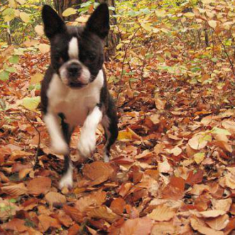
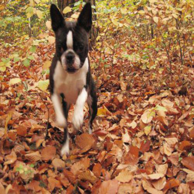

## Dog breed competition with only the pretrained models from imagenet

<font color='blue'>This post describe the method and tips I got from participanting in the Dog Breed challenge[Dog Breed challenge] in Kaggle. I managed to get an final score of 0.13783, which sets me in the 158 postion, considering a lot of competitors are leveraging the 3-rd party dataset(which already contain the test data), I believe my approach worth sharing cause there is nothing else being used except the pretrained imagenet models.(However, there are a ensembles :O)</font>
[Dog Breed challenge]: http://www.kaggle.com/c/dog-breed-identification


```python
import os
os.chdir('D:\Machine Learning\Kaggle\Dog Breed Identification\pytorch')
```

<font color='blue'>I delve into this problem firtsly using keras. However I cannot find powerful pretrained models like nasnet in Keras. Then I found this awesome package of [Pytorch pretrained models], all the models I have tryed are actually coming from this package.</font>
[Pytorch pretrained models]: http://github.com/Cadene/pretrained-models.pytorch


```python
from PIL import  Image
import torch
from torch.utils.data import Dataset,DataLoader,TensorDataset,ConcatDataset
from torchvision import transforms as trans
from torchvision import models,utils
from pathlib import Path
import pandas as pd
import matplotlib.pyplot as plt
import numpy as np
%matplotlib inline
from tqdm import tqdm
import pretrainedmodels
from torch import nn
from torch import optim
from torch.autograd import Variable
```

<font color='blue'>A dog image reading class is created using Pytorch Dataset. Please refer to the file for detail.</font>


```python
from dataset.dataset import Dogs
```

<font color='blue'>Setting all the hyperparameters,you can set *batch_size* larger if you have enough GPU memory</font>


```python
work_folder = Path('D:\Machine Learning\Kaggle\Dog Breed Identification')
train_image_folder = work_folder/'train'
test_image_folder = work_folder/'test'
bottlenecks_folder = work_folder/'pytorch'/'bottlenecks'
pred_folder = work_folder/'pred'
df_train = pd.read_csv(work_folder/'labels.csv',index_col=0)
df_test = pd.read_csv(work_folder/'sample_submission.csv',index_col=0)
img_size = 331
batch_size = 4
batch_size_top = 4096
use_cuda = torch.cuda.is_available()
date = '0222'
model_name = 'nasnet'
learning_rate = 0.0001
dropout_ratio = 0.5
input_shape = 331
crop_mode = 'center'
use_bias = True
name = '{}__model={}__lr={}__input_shape={}__drop={}__crop_mode={}__bias={}'.format(date,model_name,learning_rate,input_shape,dropout_ratio,crop_mode,use_bias)
```

<font color='blue'>I found out there 2 ways to preprocess the diffrent size image into same shape, resize and center cropping. The diffrence is subtle between them, hence it become part of hyperparameters, following transforms is tested for image preprocessing, however, after several checks I can say center cropping can gain a better result than resize.It looks like at least in this dataset it's better to keep the original image height and width ratio than keep the image margin.</font>


```python
if crop_mode == 'center':
    transforms = trans.Compose([
        trans.Resize(input_shape),
        trans.CenterCrop(input_shape),
        trans.ToTensor(),
        trans.Normalize([0.5, 0.5, 0.5],[0.5, 0.5, 0.5])])
elif crop_mode == 'resize':
    transforms = trans.Compose([
        trans.Resize((input_shape,input_shape)),
        trans.ToTensor(),
        trans.Normalize([0.5, 0.5, 0.5],[0.5, 0.5, 0.5])])
```

<font color='blue'>Create the corresponding datasets and dataloader</font>


```python
train_dataset = Dogs(train_image_folder,df_train,df_test,is_train=True,resize=False,transforms=transforms)
test_dataset = Dogs(test_image_folder,df_train,df_test,False,resize=False,transforms=transforms)
train_dataset_resize = Dogs(train_image_folder,df_train,df_test,is_train=True,resize=True,transforms=transforms)

train_loader = DataLoader(train_dataset,batch_size,num_workers=0,shuffle=False)
test_loader = DataLoader(test_dataset,batch_size,num_workers=0,shuffle=False)
```

<font color='blue'>We can see the diffrence between center crop and resize here</font>


```python
img_center_crop = train_dataset.__getitem__(0)[0]*0.5 + 0.5

transforms_resize = trans.Compose([
        trans.Resize((input_shape,input_shape)),
        trans.ToTensor(),
        trans.Normalize([0.5, 0.5, 0.5],[0.5, 0.5, 0.5])])

train_dataset_resize = Dogs(train_image_folder,df_train,df_test,is_train=True,resize=False,transforms=transforms_resize)

img_resize = train_dataset_resize.__getitem__(0)[0]*0.5 + 0.5
```


```python
trans.ToPILImage()(img_center_crop)
```





```python
trans.ToPILImage()(img_resize)
```





<font color='blue'>The key to transfer learning is to get the bottleneck outputs.Normally we are using the second last layer before the final softmax classifier.</font> 
<font color='blue'><br>For *__nasnet__* in the predefined model,we can simply realize this by changing the last 2 layers of the original model into an identity mapping.</font> 


```python
def get_extraction_model():
    nasnet = pretrainedmodels.nasnetalarge(num_classes=1000)
    nasnet = nasnet.eval()
    nasnet.avg_pool = nn.AdaptiveAvgPool2d(1)
    del nasnet.dropout
    del nasnet.last_linear
    nasnet.dropout = lambda x:x
    nasnet.last_linear = lambda x:x
    return nasnet
```


```python
extraction_nasnet = get_extraction_model()

if use_cuda:
    extraction_nasnet.cuda()
```

<font color='blue'>function to get the bottleneck output, notice that we keep the dataloader not shuffled so the output is sequential </font> 


```python
def get_bottlenecks(data_loader,extration_model,test_mode=False):
    x_pieces = []
    y_pieces = []
    for x,y in tqdm(iter(data_loader)):
        if use_cuda:
            x = Variable(x)
            y = Variable(y) if not test_mode else y
            x = x.cuda()
            y = y.cuda() if not test_mode else y
        x_pieces.append(extration_model(x).cpu().data.numpy())
        y_pieces.append(y.cpu().data.numpy()) if not test_mode else y_pieces
    bottlenecks_x = np.concatenate(x_pieces)
    bottlenecks_y = np.concatenate(y_pieces) if not test_mode else None
    return bottlenecks_x,bottlenecks_y
```


```python
bottlenecks_x,bottlenecks_y= get_bottlenecks(train_loader,extraction_nasnet)
```


```python
# np.save(bottlenecks_folder/(name+'_x'),bottlenecks_x)
# np.save(bottlenecks_folder/(name+'_y'),bottlenecks_y)

# bottlenecks_x = np.load(bottlenecks_folder/(name + '_x.npy'))
# bottlenecks_y = np.load(bottlenecks_folder/(name + '_y.npy'))
```

<font color='blue'>delete the model to save GPU memory</font> 


```python
del extraction_nasnet
```

<font color='blue'>Create the linear layer whose input is the bottleneck features, output is the 120 classes.</font> 


```python
class TopModule(nn.Module):
    def __init__(self,dropout_ratio):
        super(TopModule, self).__init__()
        self.aff = nn.Linear(4032, 120,bias=use_bias)
        self.dropout_ratio = dropout_ratio
    def forward(self,x):
        x = nn.Dropout(p = dropout_ratio)(x)
        x = self.aff(x)
        return x
```


```python
criterion = nn.CrossEntropyLoss()
criterion = criterion.cuda()
```

<font color='blue'>train and validation data split</font> 


```python
permutation = np.random.permutation(bottlenecks_x.shape[0])

x_train = bottlenecks_x[permutation][:-int(bottlenecks_x.shape[0]//5)]
x_val = bottlenecks_x[permutation][-int(bottlenecks_x.shape[0]//5):]
y_train = bottlenecks_y[permutation][:-int(bottlenecks_y.shape[0]//5)]
y_val = bottlenecks_y[permutation][-int(bottlenecks_y.shape[0]//5):]

top_only_train_dataset = TensorDataset(torch.FloatTensor(x_train),torch.LongTensor(y_train))

top_only_val_dataset = TensorDataset(torch.FloatTensor(x_val),torch.LongTensor(y_val))

top_only_train_loader = DataLoader(top_only_train_dataset,batch_size=batch_size_top,shuffle=True)
top_only_val_loader = DataLoader(top_only_val_dataset,batch_size=batch_size_top,shuffle=True)

total_dataset = ConcatDataset([top_only_train_dataset,top_only_val_dataset])
total_loader = DataLoader(total_dataset,batch_size=batch_size_top,shuffle=True)
```

<font color='blue'>training function.</font> 


```python
def fit(loader,optimizer,criterion,model=top_only_model,epochs=1500,evaluate=True):
    val_loss_history = []
    val_acc_history = []
    for epoch in range(epochs):  
        running_loss = 0.0
        for i, data in enumerate(loader, 0):
        
            inputs, labels = data
            inputs, labels = Variable(inputs), Variable(labels)
            if use_cuda:
                inputs = inputs.cuda()
                labels = labels.cuda()
        
            optimizer.zero_grad()
        
            # forward + backward 
            outputs = model(inputs)
            loss = criterion(outputs, labels)
            loss.backward()   
        
            optimizer.step()
        
        running_loss += loss.data[0]
    
        print('[%d, %5d] Train_loss: %.3f' \% (epoch+1, i+1, running_loss / len(loader)))
    
        if evaluate:
            model.eval()
            outputs = model(Variable(torch.from_numpy(x_val),volatile=True).cuda() if use_cuda else Variable(torch.from_numpy(x_val),volatile=True))
            labels = torch.from_numpy(y_val).cuda() if use_cuda else torch.from_numpy(y_val)
            labels = Variable(labels,volatile=True)
            loss = criterion(outputs,labels)
            x_val_v = Variable(torch.FloatTensor(x_val),volatile=True).cuda() if use_cuda else Variable(torch.FloatTensor(x_val),volatile=True)
            _,pred = torch.max(model(x_val_v),1)
            val_acc = np.mean(pred.cpu().data.numpy() == labels.cpu().data.numpy())
            val_loss_history.append(loss.cpu().data.numpy())
            val_acc_history.append(val_acc)
    
            print('[%d] Val_loss: %.3f'% (epoch+1, loss))
            print('[%d] Val_acc: %.3f'% (epoch+1, val_acc))
            model.train()
    
    print('Finished Training')
    return val_loss_history,val_acc_history 
```


```python
val_loss_history,val_acc_history = fit(top_only_train_loader,optimizer,criterion,top_only_model,epochs=1500,evaluate=True)
```

    [1,     2] Train_loss: 2.384
    [1] Val_loss: 4.732
    [1] Val_acc: 0.019
    [2,     2] Train_loss: 2.349
    [2] Val_loss: 4.677
    [2] Val_acc: 0.046
    [3,     2] Train_loss: 2.318
    [3] Val_loss: 4.610
    [3] Val_acc: 0.094
    [4,     2] Train_loss: 2.288
    [4] Val_loss: 4.547
    [4] Val_acc: 0.171
    [5,     2] Train_loss: 2.258
    [5] Val_loss: 4.487
    [5] Val_acc: 0.271
    [6,     2] Train_loss: 2.227
    [6] Val_loss: 4.429
    [6] Val_acc: 0.382
    [7,     2] Train_loss: 2.197
    [7] Val_loss: 4.368
    [7] Val_acc: 0.500
    [8,     2] Train_loss: 2.165
    [8] Val_loss: 4.309
    [8] Val_acc: 0.604
    [9,     2] Train_loss: 2.135
    [9] Val_loss: 4.244
    [9] Val_acc: 0.693
    [10,     2] Train_loss: 2.102
    [10] Val_loss: 4.186
    [10] Val_acc: 0.751
    [11,     2] Train_loss: 2.075
    [11] Val_loss: 4.130
    [11] Val_acc: 0.803
    [12,     2] Train_loss: 2.043
    [12] Val_loss: 4.073
    [12] Val_acc: 0.823
    [13,     2] Train_loss: 2.013
    [13] Val_loss: 4.006
    [13] Val_acc: 0.851
    [14,     2] Train_loss: 1.983
    [14] Val_loss: 3.948
    [14] Val_acc: 0.872
    [15,     2] Train_loss: 1.952
    [15] Val_loss: 3.889
    [15] Val_acc: 0.876
    [16,     2] Train_loss: 1.923
    [16] Val_loss: 3.829
    [16] Val_acc: 0.894
    [17,     2] Train_loss: 1.891
    [17] Val_loss: 3.770
    [17] Val_acc: 0.897
    [18,     2] Train_loss: 1.862
    [18] Val_loss: 3.713
    [18] Val_acc: 0.905
    [19,     2] Train_loss: 1.831
    [19] Val_loss: 3.657
    [19] Val_acc: 0.905
    [20,     2] Train_loss: 1.803
    [20] Val_loss: 3.591
    [20] Val_acc: 0.905
    [21,     2] Train_loss: 1.775
    [21] Val_loss: 3.535
    [21] Val_acc: 0.911
    [22,     2] Train_loss: 1.746
    [22] Val_loss: 3.478
    [22] Val_acc: 0.922
    [23,     2] Train_loss: 1.714
    [23] Val_loss: 3.421
    [23] Val_acc: 0.916
    [24,     2] Train_loss: 1.686
    [24] Val_loss: 3.360
    [24] Val_acc: 0.924
    [25,     2] Train_loss: 1.658
    [25] Val_loss: 3.305
    [25] Val_acc: 0.916
    [26,     2] Train_loss: 1.628
    [26] Val_loss: 3.250
    [26] Val_acc: 0.921
    [27,     2] Train_loss: 1.599
    [27] Val_loss: 3.204
    [27] Val_acc: 0.922
    [28,     2] Train_loss: 1.573
    [28] Val_loss: 3.140
    [28] Val_acc: 0.923
    [29,     2] Train_loss: 1.545
    [29] Val_loss: 3.083
    [29] Val_acc: 0.925
    [30,     2] Train_loss: 1.516
    [30] Val_loss: 3.028
    [30] Val_acc: 0.924
    [31,     2] Train_loss: 1.488
    [31] Val_loss: 2.975
    [31] Val_acc: 0.925
    [32,     2] Train_loss: 1.460
    [32] Val_loss: 2.917
    [32] Val_acc: 0.928
    [33,     2] Train_loss: 1.430
    [33] Val_loss: 2.868
    [33] Val_acc: 0.926
    [34,     2] Train_loss: 1.406
    [34] Val_loss: 2.815
    [34] Val_acc: 0.927
    [35,     2] Train_loss: 1.375
    [35] Val_loss: 2.756
    [35] Val_acc: 0.927
    [36,     2] Train_loss: 1.351
    [36] Val_loss: 2.708
    [36] Val_acc: 0.925
    [37,     2] Train_loss: 1.323
    [37] Val_loss: 2.656
    [37] Val_acc: 0.930
    [38,     2] Train_loss: 1.300
    [38] Val_loss: 2.609
    [38] Val_acc: 0.929
    [39,     2] Train_loss: 1.273
    [39] Val_loss: 2.554
    [39] Val_acc: 0.929
    [40,     2] Train_loss: 1.245
    [40] Val_loss: 2.501
    [40] Val_acc: 0.926
    [41,     2] Train_loss: 1.221
    [41] Val_loss: 2.442
    [41] Val_acc: 0.932
    [42,     2] Train_loss: 1.193
    [42] Val_loss: 2.396
    [42] Val_acc: 0.935
    [43,     2] Train_loss: 1.171
    [43] Val_loss: 2.345
    [43] Val_acc: 0.929
    [44,     2] Train_loss: 1.146
    [44] Val_loss: 2.294
    [44] Val_acc: 0.932
    [45,     2] Train_loss: 1.119
    [45] Val_loss: 2.250
    [45] Val_acc: 0.929
    [46,     2] Train_loss: 1.098
    [46] Val_loss: 2.206
    [46] Val_acc: 0.935
    [47,     2] Train_loss: 1.072
    [47] Val_loss: 2.157
    [47] Val_acc: 0.932
    [48,     2] Train_loss: 1.051
    [48] Val_loss: 2.108
    [48] Val_acc: 0.932
    [49,     2] Train_loss: 1.026
    [49] Val_loss: 2.065
    [49] Val_acc: 0.930
    [50,     2] Train_loss: 1.003
    [50] Val_loss: 2.020
    [50] Val_acc: 0.931
    [51,     2] Train_loss: 0.975
    [51] Val_loss: 1.975
    [51] Val_acc: 0.931
    [52,     2] Train_loss: 0.960
    [52] Val_loss: 1.925
    [52] Val_acc: 0.931
    [53,     2] Train_loss: 0.938
    [53] Val_loss: 1.883
    [53] Val_acc: 0.933
    [54,     2] Train_loss: 0.917
    [54] Val_loss: 1.844
    [54] Val_acc: 0.931
    [55,     2] Train_loss: 0.896
    [55] Val_loss: 1.805
    [55] Val_acc: 0.933
    [56,     2] Train_loss: 0.871
    [56] Val_loss: 1.758
    [56] Val_acc: 0.933
    [57,     2] Train_loss: 0.853
    [57] Val_loss: 1.721
    [57] Val_acc: 0.933
    [58,     2] Train_loss: 0.834
    [58] Val_loss: 1.685
    [58] Val_acc: 0.932
    [59,     2] Train_loss: 0.814
    [59] Val_loss: 1.640
    [59] Val_acc: 0.932
    [60,     2] Train_loss: 0.794
    [60] Val_loss: 1.609
    [60] Val_acc: 0.934
    [61,     2] Train_loss: 0.777
    [61] Val_loss: 1.572
    [61] Val_acc: 0.934
    [62,     2] Train_loss: 0.753
    [62] Val_loss: 1.541
    [62] Val_acc: 0.932
    [63,     2] Train_loss: 0.740
    [63] Val_loss: 1.495
    [63] Val_acc: 0.932
    [64,     2] Train_loss: 0.719
    [64] Val_loss: 1.463
    [64] Val_acc: 0.936
    [65,     2] Train_loss: 0.708
    [65] Val_loss: 1.431
    [65] Val_acc: 0.937
    [66,     2] Train_loss: 0.683
    [66] Val_loss: 1.397
    [66] Val_acc: 0.933
    [67,     2] Train_loss: 0.670
    [67] Val_loss: 1.365
    [67] Val_acc: 0.934
    [68,     2] Train_loss: 0.652
    [68] Val_loss: 1.337
    [68] Val_acc: 0.936
    [69,     2] Train_loss: 0.644
    [69] Val_loss: 1.308
    [69] Val_acc: 0.935
    [70,     2] Train_loss: 0.624
    [70] Val_loss: 1.276
    [70] Val_acc: 0.940
    [71,     2] Train_loss: 0.618
    [71] Val_loss: 1.252
    [71] Val_acc: 0.936
    [72,     2] Train_loss: 0.600
    [72] Val_loss: 1.224
    [72] Val_acc: 0.934
    [73,     2] Train_loss: 0.581
    [73] Val_loss: 1.197
    [73] Val_acc: 0.936
    [74,     2] Train_loss: 0.570
    [74] Val_loss: 1.168
    [74] Val_acc: 0.937
    [75,     2] Train_loss: 0.562
    [75] Val_loss: 1.138
    [75] Val_acc: 0.937
    [76,     2] Train_loss: 0.549
    [76] Val_loss: 1.110
    [76] Val_acc: 0.934
    [77,     2] Train_loss: 0.534
    [77] Val_loss: 1.089
    [77] Val_acc: 0.935
    [78,     2] Train_loss: 0.523
    [78] Val_loss: 1.061
    [78] Val_acc: 0.935
    [79,     2] Train_loss: 0.511
    [79] Val_loss: 1.043
    [79] Val_acc: 0.938
    [80,     2] Train_loss: 0.501
    [80] Val_loss: 1.027
    [80] Val_acc: 0.936
    [81,     2] Train_loss: 0.485
    [81] Val_loss: 1.002
    [81] Val_acc: 0.938
    [82,     2] Train_loss: 0.474
    [82] Val_loss: 0.985
    [82] Val_acc: 0.933
    [83,     2] Train_loss: 0.467
    [83] Val_loss: 0.963
    [83] Val_acc: 0.937
    [84,     2] Train_loss: 0.462
    [84] Val_loss: 0.942
    [84] Val_acc: 0.938
    [85,     2] Train_loss: 0.447
    [85] Val_loss: 0.929
    [85] Val_acc: 0.936
    [86,     2] Train_loss: 0.440
    [86] Val_loss: 0.901
    [86] Val_acc: 0.939
    [87,     2] Train_loss: 0.430
    [87] Val_loss: 0.888
    [87] Val_acc: 0.941
    [88,     2] Train_loss: 0.418
    [88] Val_loss: 0.868
    [88] Val_acc: 0.938
    [89,     2] Train_loss: 0.409
    [89] Val_loss: 0.853
    [89] Val_acc: 0.938
    [90,     2] Train_loss: 0.404
    [90] Val_loss: 0.840
    [90] Val_acc: 0.939
    [91,     2] Train_loss: 0.392
    [91] Val_loss: 0.819
    [91] Val_acc: 0.936
    [92,     2] Train_loss: 0.387
    [92] Val_loss: 0.800
    [92] Val_acc: 0.939
    [93,     2] Train_loss: 0.380
    [93] Val_loss: 0.790
    [93] Val_acc: 0.939
    [94,     2] Train_loss: 0.376
    [94] Val_loss: 0.778
    [94] Val_acc: 0.935
    [95,     2] Train_loss: 0.369
    [95] Val_loss: 0.760
    [95] Val_acc: 0.938
    [96,     2] Train_loss: 0.360
    [96] Val_loss: 0.750
    [96] Val_acc: 0.937
    [97,     2] Train_loss: 0.353
    [97] Val_loss: 0.735
    [97] Val_acc: 0.935
    [98,     2] Train_loss: 0.345
    [98] Val_loss: 0.728
    [98] Val_acc: 0.935
    [99,     2] Train_loss: 0.339
    [99] Val_loss: 0.706
    [99] Val_acc: 0.943
    [100,     2] Train_loss: 0.338
    [100] Val_loss: 0.706
    [100] Val_acc: 0.937
    [101,     2] Train_loss: 0.327
    [101] Val_loss: 0.682
    [101] Val_acc: 0.938
    [102,     2] Train_loss: 0.320
    [102] Val_loss: 0.676
    [102] Val_acc: 0.940
    [103,     2] Train_loss: 0.321
    [103] Val_loss: 0.666
    [103] Val_acc: 0.936
    [104,     2] Train_loss: 0.313
    [104] Val_loss: 0.655
    [104] Val_acc: 0.940
    [105,     2] Train_loss: 0.311
    [105] Val_loss: 0.648
    [105] Val_acc: 0.941
    [106,     2] Train_loss: 0.307
    [106] Val_loss: 0.635
    [106] Val_acc: 0.937
    [107,     2] Train_loss: 0.299
    [107] Val_loss: 0.626
    [107] Val_acc: 0.939
    [108,     2] Train_loss: 0.293
    [108] Val_loss: 0.614
    [108] Val_acc: 0.937
    [109,     2] Train_loss: 0.293
    [109] Val_loss: 0.609
    [109] Val_acc: 0.938
    [110,     2] Train_loss: 0.285
    [110] Val_loss: 0.598
    [110] Val_acc: 0.940
    [111,     2] Train_loss: 0.276
    [111] Val_loss: 0.589
    [111] Val_acc: 0.942
    [112,     2] Train_loss: 0.279
    [112] Val_loss: 0.583
    [112] Val_acc: 0.939
    [113,     2] Train_loss: 0.271
    [113] Val_loss: 0.573
    [113] Val_acc: 0.939
    [114,     2] Train_loss: 0.269
    [114] Val_loss: 0.565
    [114] Val_acc: 0.940
    [115,     2] Train_loss: 0.265
    [115] Val_loss: 0.562
    [115] Val_acc: 0.940
    [116,     2] Train_loss: 0.258
    [116] Val_loss: 0.553
    [116] Val_acc: 0.940
    [117,     2] Train_loss: 0.254
    [117] Val_loss: 0.545
    [117] Val_acc: 0.941
    [118,     2] Train_loss: 0.254
    [118] Val_loss: 0.540
    [118] Val_acc: 0.941
    [119,     2] Train_loss: 0.252
    [119] Val_loss: 0.529
    [119] Val_acc: 0.942
    [120,     2] Train_loss: 0.248
    [120] Val_loss: 0.525
    [120] Val_acc: 0.938
    [121,     2] Train_loss: 0.248
    [121] Val_loss: 0.516
    [121] Val_acc: 0.938
    [122,     2] Train_loss: 0.242
    [122] Val_loss: 0.510
    [122] Val_acc: 0.939
    [123,     2] Train_loss: 0.237
    [123] Val_loss: 0.512
    [123] Val_acc: 0.942
    [124,     2] Train_loss: 0.236
    [124] Val_loss: 0.500
    [124] Val_acc: 0.939
    [125,     2] Train_loss: 0.233
    [125] Val_loss: 0.493
    [125] Val_acc: 0.940
    [126,     2] Train_loss: 0.227
    [126] Val_loss: 0.490
    [126] Val_acc: 0.942
    [127,     2] Train_loss: 0.230
    [127] Val_loss: 0.487
    [127] Val_acc: 0.938
    [128,     2] Train_loss: 0.227
    [128] Val_loss: 0.482
    [128] Val_acc: 0.944
    [129,     2] Train_loss: 0.225
    [129] Val_loss: 0.474
    [129] Val_acc: 0.938
    [130,     2] Train_loss: 0.220
    [130] Val_loss: 0.471
    [130] Val_acc: 0.940
    [131,     2] Train_loss: 0.218
    [131] Val_loss: 0.465
    [131] Val_acc: 0.941
    [132,     2] Train_loss: 0.210
    [132] Val_loss: 0.464
    [132] Val_acc: 0.940
    [133,     2] Train_loss: 0.210
    [133] Val_loss: 0.458
    [133] Val_acc: 0.939
    [134,     2] Train_loss: 0.211
    [134] Val_loss: 0.455
    [134] Val_acc: 0.939
    [135,     2] Train_loss: 0.211
    [135] Val_loss: 0.447
    [135] Val_acc: 0.939
    [136,     2] Train_loss: 0.206
    [136] Val_loss: 0.444
    [136] Val_acc: 0.939
    [137,     2] Train_loss: 0.205
    [137] Val_loss: 0.440
    [137] Val_acc: 0.941
    [138,     2] Train_loss: 0.202
    [138] Val_loss: 0.439
    [138] Val_acc: 0.941
    [139,     2] Train_loss: 0.201
    [139] Val_loss: 0.428
    [139] Val_acc: 0.942
    [140,     2] Train_loss: 0.196
    [140] Val_loss: 0.427
    [140] Val_acc: 0.939
    [141,     2] Train_loss: 0.199
    [141] Val_loss: 0.421
    [141] Val_acc: 0.940
    [142,     2] Train_loss: 0.192
    [142] Val_loss: 0.422
    [142] Val_acc: 0.940
    [143,     2] Train_loss: 0.190
    [143] Val_loss: 0.415
    [143] Val_acc: 0.940
    [144,     2] Train_loss: 0.186
    [144] Val_loss: 0.412
    [144] Val_acc: 0.941
    [145,     2] Train_loss: 0.185
    [145] Val_loss: 0.409
    [145] Val_acc: 0.939
    [146,     2] Train_loss: 0.192
    [146] Val_loss: 0.403
    [146] Val_acc: 0.940
    [147,     2] Train_loss: 0.185
    [147] Val_loss: 0.404
    [147] Val_acc: 0.942
    [148,     2] Train_loss: 0.178
    [148] Val_loss: 0.401
    [148] Val_acc: 0.937
    [149,     2] Train_loss: 0.178
    [149] Val_loss: 0.395
    [149] Val_acc: 0.940
    [150,     2] Train_loss: 0.183
    [150] Val_loss: 0.392
    [150] Val_acc: 0.943
    [151,     2] Train_loss: 0.183
    [151] Val_loss: 0.390
    [151] Val_acc: 0.943
    [152,     2] Train_loss: 0.179
    [152] Val_loss: 0.389
    [152] Val_acc: 0.940
    [153,     2] Train_loss: 0.176
    [153] Val_loss: 0.385
    [153] Val_acc: 0.940
    [154,     2] Train_loss: 0.175
    [154] Val_loss: 0.384
    [154] Val_acc: 0.943
    [155,     2] Train_loss: 0.169
    [155] Val_loss: 0.379
    [155] Val_acc: 0.940
    [156,     2] Train_loss: 0.174
    [156] Val_loss: 0.378
    [156] Val_acc: 0.939
    [157,     2] Train_loss: 0.169
    [157] Val_loss: 0.374
    [157] Val_acc: 0.941
    [158,     2] Train_loss: 0.163
    [158] Val_loss: 0.369
    [158] Val_acc: 0.939
    [159,     2] Train_loss: 0.164
    [159] Val_loss: 0.374
    [159] Val_acc: 0.939
    [160,     2] Train_loss: 0.160
    [160] Val_loss: 0.365
    [160] Val_acc: 0.941
    [161,     2] Train_loss: 0.165
    [161] Val_loss: 0.364
    [161] Val_acc: 0.941
    [162,     2] Train_loss: 0.161
    [162] Val_loss: 0.363
    [162] Val_acc: 0.940
    [163,     2] Train_loss: 0.164
    [163] Val_loss: 0.361
    [163] Val_acc: 0.940
    [164,     2] Train_loss: 0.163
    [164] Val_loss: 0.358
    [164] Val_acc: 0.940
    [165,     2] Train_loss: 0.166
    [165] Val_loss: 0.356
    [165] Val_acc: 0.942
    [166,     2] Train_loss: 0.157
    [166] Val_loss: 0.357
    [166] Val_acc: 0.943
    [167,     2] Train_loss: 0.162
    [167] Val_loss: 0.350
    [167] Val_acc: 0.941
    [168,     2] Train_loss: 0.154
    [168] Val_loss: 0.348
    [168] Val_acc: 0.939
    [169,     2] Train_loss: 0.153
    [169] Val_loss: 0.349
    [169] Val_acc: 0.942
    [170,     2] Train_loss: 0.155
    [170] Val_loss: 0.344
    [170] Val_acc: 0.941
    [171,     2] Train_loss: 0.155
    [171] Val_loss: 0.343
    [171] Val_acc: 0.939
    [172,     2] Train_loss: 0.151
    [172] Val_loss: 0.340
    [172] Val_acc: 0.940
    [173,     2] Train_loss: 0.148
    [173] Val_loss: 0.338
    [173] Val_acc: 0.942
    [174,     2] Train_loss: 0.154
    [174] Val_loss: 0.338
    [174] Val_acc: 0.940
    [175,     2] Train_loss: 0.152
    [175] Val_loss: 0.336
    [175] Val_acc: 0.939
    [176,     2] Train_loss: 0.146
    [176] Val_loss: 0.335
    [176] Val_acc: 0.941
    [177,     2] Train_loss: 0.146
    [177] Val_loss: 0.331
    [177] Val_acc: 0.942
    [178,     2] Train_loss: 0.142
    [178] Val_loss: 0.330
    [178] Val_acc: 0.941
    [179,     2] Train_loss: 0.147
    [179] Val_loss: 0.330
    [179] Val_acc: 0.939
    [180,     2] Train_loss: 0.140
    [180] Val_loss: 0.326
    [180] Val_acc: 0.940
    [181,     2] Train_loss: 0.139
    [181] Val_loss: 0.326
    [181] Val_acc: 0.942
    [182,     2] Train_loss: 0.142
    [182] Val_loss: 0.325
    [182] Val_acc: 0.941
    [183,     2] Train_loss: 0.142
    [183] Val_loss: 0.319
    [183] Val_acc: 0.939
    [184,     2] Train_loss: 0.140
    [184] Val_loss: 0.321
    [184] Val_acc: 0.942
    [185,     2] Train_loss: 0.141
    [185] Val_loss: 0.319
    [185] Val_acc: 0.944
    [186,     2] Train_loss: 0.141
    [186] Val_loss: 0.319
    [186] Val_acc: 0.941
    [187,     2] Train_loss: 0.139
    [187] Val_loss: 0.314
    [187] Val_acc: 0.941
    [188,     2] Train_loss: 0.134
    [188] Val_loss: 0.316
    [188] Val_acc: 0.939
    [189,     2] Train_loss: 0.140
    [189] Val_loss: 0.315
    [189] Val_acc: 0.943
    [190,     2] Train_loss: 0.138
    [190] Val_loss: 0.316
    [190] Val_acc: 0.941
    [191,     2] Train_loss: 0.139
    [191] Val_loss: 0.313
    [191] Val_acc: 0.940
    [192,     2] Train_loss: 0.133
    [192] Val_loss: 0.305
    [192] Val_acc: 0.941
    [193,     2] Train_loss: 0.133
    [193] Val_loss: 0.308
    [193] Val_acc: 0.939
    [194,     2] Train_loss: 0.136
    [194] Val_loss: 0.307
    [194] Val_acc: 0.941
    [195,     2] Train_loss: 0.132
    [195] Val_loss: 0.306
    [195] Val_acc: 0.941
    [196,     2] Train_loss: 0.131
    [196] Val_loss: 0.306
    [196] Val_acc: 0.943
    [197,     2] Train_loss: 0.129
    [197] Val_loss: 0.306
    [197] Val_acc: 0.941
    [198,     2] Train_loss: 0.132
    [198] Val_loss: 0.302
    [198] Val_acc: 0.940
    [199,     2] Train_loss: 0.128
    [199] Val_loss: 0.299
    [199] Val_acc: 0.942
    [200,     2] Train_loss: 0.127
    [200] Val_loss: 0.296
    [200] Val_acc: 0.940
    [201,     2] Train_loss: 0.126
    [201] Val_loss: 0.297
    [201] Val_acc: 0.940
    [202,     2] Train_loss: 0.124
    [202] Val_loss: 0.299
    [202] Val_acc: 0.944
    [203,     2] Train_loss: 0.125
    [203] Val_loss: 0.296
    [203] Val_acc: 0.940
    [204,     2] Train_loss: 0.122
    [204] Val_loss: 0.293
    [204] Val_acc: 0.942
    [205,     2] Train_loss: 0.127
    [205] Val_loss: 0.294
    [205] Val_acc: 0.944
    [206,     2] Train_loss: 0.122
    [206] Val_loss: 0.294
    [206] Val_acc: 0.939
    [207,     2] Train_loss: 0.125
    [207] Val_loss: 0.292
    [207] Val_acc: 0.943
    [208,     2] Train_loss: 0.119
    [208] Val_loss: 0.289
    [208] Val_acc: 0.942
    [209,     2] Train_loss: 0.123
    [209] Val_loss: 0.287
    [209] Val_acc: 0.941
    [210,     2] Train_loss: 0.123
    [210] Val_loss: 0.286
    [210] Val_acc: 0.941
    [211,     2] Train_loss: 0.118
    [211] Val_loss: 0.288
    [211] Val_acc: 0.944
    [212,     2] Train_loss: 0.121
    [212] Val_loss: 0.287
    [212] Val_acc: 0.940
    [213,     2] Train_loss: 0.123
    [213] Val_loss: 0.288
    [213] Val_acc: 0.941
    [214,     2] Train_loss: 0.120
    [214] Val_loss: 0.284
    [214] Val_acc: 0.944
    [215,     2] Train_loss: 0.117
    [215] Val_loss: 0.283
    [215] Val_acc: 0.940
    [216,     2] Train_loss: 0.118
    [216] Val_loss: 0.282
    [216] Val_acc: 0.942
    [217,     2] Train_loss: 0.122
    [217] Val_loss: 0.283
    [217] Val_acc: 0.945
    [218,     2] Train_loss: 0.124
    [218] Val_loss: 0.279
    [218] Val_acc: 0.941
    [219,     2] Train_loss: 0.115
    [219] Val_loss: 0.279
    [219] Val_acc: 0.940
    [220,     2] Train_loss: 0.122
    [220] Val_loss: 0.279
    [220] Val_acc: 0.945
    [221,     2] Train_loss: 0.117
    [221] Val_loss: 0.279
    [221] Val_acc: 0.941
    [222,     2] Train_loss: 0.116
    [222] Val_loss: 0.278
    [222] Val_acc: 0.944
    [223,     2] Train_loss: 0.116
    [223] Val_loss: 0.280
    [223] Val_acc: 0.942
    [224,     2] Train_loss: 0.116
    [224] Val_loss: 0.273
    [224] Val_acc: 0.942
    [225,     2] Train_loss: 0.117
    [225] Val_loss: 0.272
    [225] Val_acc: 0.944
    [226,     2] Train_loss: 0.117
    [226] Val_loss: 0.274
    [226] Val_acc: 0.942
    [227,     2] Train_loss: 0.119
    [227] Val_loss: 0.277
    [227] Val_acc: 0.941
    [228,     2] Train_loss: 0.112
    [228] Val_loss: 0.273
    [228] Val_acc: 0.941
    [229,     2] Train_loss: 0.115
    [229] Val_loss: 0.270
    [229] Val_acc: 0.942
    [230,     2] Train_loss: 0.108
    [230] Val_loss: 0.269
    [230] Val_acc: 0.944
    [231,     2] Train_loss: 0.112
    [231] Val_loss: 0.270
    [231] Val_acc: 0.943
    [232,     2] Train_loss: 0.111
    [232] Val_loss: 0.269
    [232] Val_acc: 0.943
    [233,     2] Train_loss: 0.113
    [233] Val_loss: 0.272
    [233] Val_acc: 0.943
    [234,     2] Train_loss: 0.115
    [234] Val_loss: 0.269
    [234] Val_acc: 0.942
    [235,     2] Train_loss: 0.115
    [235] Val_loss: 0.268
    [235] Val_acc: 0.942
    [236,     2] Train_loss: 0.109
    [236] Val_loss: 0.266
    [236] Val_acc: 0.942
    [237,     2] Train_loss: 0.114
    [237] Val_loss: 0.266
    [237] Val_acc: 0.942
    [238,     2] Train_loss: 0.104
    [238] Val_loss: 0.263
    [238] Val_acc: 0.942
    [239,     2] Train_loss: 0.108
    [239] Val_loss: 0.265
    [239] Val_acc: 0.944
    [240,     2] Train_loss: 0.109
    [240] Val_loss: 0.263
    [240] Val_acc: 0.943
    [241,     2] Train_loss: 0.108
    [241] Val_loss: 0.262
    [241] Val_acc: 0.945
    [242,     2] Train_loss: 0.105
    [242] Val_loss: 0.262
    [242] Val_acc: 0.942
    [243,     2] Train_loss: 0.106
    [243] Val_loss: 0.259
    [243] Val_acc: 0.945
    [244,     2] Train_loss: 0.109
    [244] Val_loss: 0.263
    [244] Val_acc: 0.946
    [245,     2] Train_loss: 0.107
    [245] Val_loss: 0.260
    [245] Val_acc: 0.942
    [246,     2] Train_loss: 0.104
    [246] Val_loss: 0.260
    [246] Val_acc: 0.943
    [247,     2] Train_loss: 0.107
    [247] Val_loss: 0.257
    [247] Val_acc: 0.942
    [248,     2] Train_loss: 0.104
    [248] Val_loss: 0.258
    [248] Val_acc: 0.944
    [249,     2] Train_loss: 0.108
    [249] Val_loss: 0.257
    [249] Val_acc: 0.940
    [250,     2] Train_loss: 0.105
    [250] Val_loss: 0.258
    [250] Val_acc: 0.941
    [251,     2] Train_loss: 0.100
    [251] Val_loss: 0.256
    [251] Val_acc: 0.942
    [252,     2] Train_loss: 0.106
    [252] Val_loss: 0.252
    [252] Val_acc: 0.943
    [253,     2] Train_loss: 0.104
    [253] Val_loss: 0.255
    [253] Val_acc: 0.941
    [254,     2] Train_loss: 0.104
    [254] Val_loss: 0.254
    [254] Val_acc: 0.945
    [255,     2] Train_loss: 0.105
    [255] Val_loss: 0.256
    [255] Val_acc: 0.944
    [256,     2] Train_loss: 0.104
    [256] Val_loss: 0.255
    [256] Val_acc: 0.941
    [257,     2] Train_loss: 0.097
    [257] Val_loss: 0.253
    [257] Val_acc: 0.941
    [258,     2] Train_loss: 0.099
    [258] Val_loss: 0.251
    [258] Val_acc: 0.944
    [259,     2] Train_loss: 0.104
    [259] Val_loss: 0.250
    [259] Val_acc: 0.942
    [260,     2] Train_loss: 0.098
    [260] Val_loss: 0.251
    [260] Val_acc: 0.942
    [261,     2] Train_loss: 0.102
    [261] Val_loss: 0.252
    [261] Val_acc: 0.939
    [262,     2] Train_loss: 0.097
    [262] Val_loss: 0.254
    [262] Val_acc: 0.943
    [263,     2] Train_loss: 0.100
    [263] Val_loss: 0.250
    [263] Val_acc: 0.943
    [264,     2] Train_loss: 0.099
    [264] Val_loss: 0.250
    [264] Val_acc: 0.941
    [265,     2] Train_loss: 0.104
    [265] Val_loss: 0.249
    [265] Val_acc: 0.941
    [266,     2] Train_loss: 0.105
    [266] Val_loss: 0.252
    [266] Val_acc: 0.943
    [267,     2] Train_loss: 0.095
    [267] Val_loss: 0.245
    [267] Val_acc: 0.941
    [268,     2] Train_loss: 0.100
    [268] Val_loss: 0.245
    [268] Val_acc: 0.942
    [269,     2] Train_loss: 0.099
    [269] Val_loss: 0.251
    [269] Val_acc: 0.940
    [270,     2] Train_loss: 0.095
    [270] Val_loss: 0.248
    [270] Val_acc: 0.942
    [271,     2] Train_loss: 0.100
    [271] Val_loss: 0.251
    [271] Val_acc: 0.942
    [272,     2] Train_loss: 0.101
    [272] Val_loss: 0.241
    [272] Val_acc: 0.946
    [273,     2] Train_loss: 0.097
    [273] Val_loss: 0.247
    [273] Val_acc: 0.941
    [274,     2] Train_loss: 0.097
    [274] Val_loss: 0.244
    [274] Val_acc: 0.942
    [275,     2] Train_loss: 0.093
    [275] Val_loss: 0.245
    [275] Val_acc: 0.941
    [276,     2] Train_loss: 0.091
    [276] Val_loss: 0.245
    [276] Val_acc: 0.943
    [277,     2] Train_loss: 0.090
    [277] Val_loss: 0.245
    [277] Val_acc: 0.941
    [278,     2] Train_loss: 0.096
    [278] Val_loss: 0.245
    [278] Val_acc: 0.943
    [279,     2] Train_loss: 0.097
    [279] Val_loss: 0.244
    [279] Val_acc: 0.941
    [280,     2] Train_loss: 0.094
    [280] Val_loss: 0.243
    [280] Val_acc: 0.942
    [281,     2] Train_loss: 0.093
    [281] Val_loss: 0.243
    [281] Val_acc: 0.943
    [282,     2] Train_loss: 0.095
    [282] Val_loss: 0.241
    [282] Val_acc: 0.943
    [283,     2] Train_loss: 0.097
    [283] Val_loss: 0.242
    [283] Val_acc: 0.941
    [284,     2] Train_loss: 0.092
    [284] Val_loss: 0.242
    [284] Val_acc: 0.943
    [285,     2] Train_loss: 0.093
    [285] Val_loss: 0.238
    [285] Val_acc: 0.940
    [286,     2] Train_loss: 0.093
    [286] Val_loss: 0.240
    [286] Val_acc: 0.944
    [287,     2] Train_loss: 0.088
    [287] Val_loss: 0.238
    [287] Val_acc: 0.947
    [288,     2] Train_loss: 0.095
    [288] Val_loss: 0.241
    [288] Val_acc: 0.942
    [289,     2] Train_loss: 0.093
    [289] Val_loss: 0.241
    [289] Val_acc: 0.943
    [290,     2] Train_loss: 0.093
    [290] Val_loss: 0.241
    [290] Val_acc: 0.943
    [291,     2] Train_loss: 0.090
    [291] Val_loss: 0.239
    [291] Val_acc: 0.945
    [292,     2] Train_loss: 0.089
    [292] Val_loss: 0.237
    [292] Val_acc: 0.943
    [293,     2] Train_loss: 0.094
    [293] Val_loss: 0.238
    [293] Val_acc: 0.941
    [294,     2] Train_loss: 0.093
    [294] Val_loss: 0.239
    [294] Val_acc: 0.941
    [295,     2] Train_loss: 0.085
    [295] Val_loss: 0.235
    [295] Val_acc: 0.944
    [296,     2] Train_loss: 0.091
    [296] Val_loss: 0.235
    [296] Val_acc: 0.942
    [297,     2] Train_loss: 0.091
    [297] Val_loss: 0.235
    [297] Val_acc: 0.941
    [298,     2] Train_loss: 0.094
    [298] Val_loss: 0.233
    [298] Val_acc: 0.942
    [299,     2] Train_loss: 0.085
    [299] Val_loss: 0.235
    [299] Val_acc: 0.943
    [300,     2] Train_loss: 0.087
    [300] Val_loss: 0.233
    [300] Val_acc: 0.942
    [301,     2] Train_loss: 0.092
    [301] Val_loss: 0.235
    [301] Val_acc: 0.943
    [302,     2] Train_loss: 0.087
    [302] Val_loss: 0.233
    [302] Val_acc: 0.943
    [303,     2] Train_loss: 0.085
    [303] Val_loss: 0.233
    [303] Val_acc: 0.941
    [304,     2] Train_loss: 0.091
    [304] Val_loss: 0.234
    [304] Val_acc: 0.942
    [305,     2] Train_loss: 0.087
    [305] Val_loss: 0.232
    [305] Val_acc: 0.944
    [306,     2] Train_loss: 0.090
    [306] Val_loss: 0.237
    [306] Val_acc: 0.943
    [307,     2] Train_loss: 0.088
    [307] Val_loss: 0.232
    [307] Val_acc: 0.946
    [308,     2] Train_loss: 0.089
    [308] Val_loss: 0.229
    [308] Val_acc: 0.943
    [309,     2] Train_loss: 0.084
    [309] Val_loss: 0.231
    [309] Val_acc: 0.941
    [310,     2] Train_loss: 0.090
    [310] Val_loss: 0.232
    [310] Val_acc: 0.940
    [311,     2] Train_loss: 0.092
    [311] Val_loss: 0.231
    [311] Val_acc: 0.943
    [312,     2] Train_loss: 0.089
    [312] Val_loss: 0.232
    [312] Val_acc: 0.941
    [313,     2] Train_loss: 0.086
    [313] Val_loss: 0.233
    [313] Val_acc: 0.942
    [314,     2] Train_loss: 0.086
    [314] Val_loss: 0.234
    [314] Val_acc: 0.941
    [315,     2] Train_loss: 0.084
    [315] Val_loss: 0.231
    [315] Val_acc: 0.944
    [316,     2] Train_loss: 0.084
    [316] Val_loss: 0.231
    [316] Val_acc: 0.942
    [317,     2] Train_loss: 0.089
    [317] Val_loss: 0.226
    [317] Val_acc: 0.942
    [318,     2] Train_loss: 0.085
    [318] Val_loss: 0.233
    [318] Val_acc: 0.941
    [319,     2] Train_loss: 0.092
    [319] Val_loss: 0.229
    [319] Val_acc: 0.942
    [320,     2] Train_loss: 0.085
    [320] Val_loss: 0.228
    [320] Val_acc: 0.944
    [321,     2] Train_loss: 0.083
    [321] Val_loss: 0.227
    [321] Val_acc: 0.945
    [322,     2] Train_loss: 0.085
    [322] Val_loss: 0.229
    [322] Val_acc: 0.944
    [323,     2] Train_loss: 0.082
    [323] Val_loss: 0.230
    [323] Val_acc: 0.943
    [324,     2] Train_loss: 0.082
    [324] Val_loss: 0.229
    [324] Val_acc: 0.943
    [325,     2] Train_loss: 0.080
    [325] Val_loss: 0.227
    [325] Val_acc: 0.942
    [326,     2] Train_loss: 0.087
    [326] Val_loss: 0.228
    [326] Val_acc: 0.944
    [327,     2] Train_loss: 0.083
    [327] Val_loss: 0.225
    [327] Val_acc: 0.942
    [328,     2] Train_loss: 0.083
    [328] Val_loss: 0.229
    [328] Val_acc: 0.943
    [329,     2] Train_loss: 0.084
    [329] Val_loss: 0.225
    [329] Val_acc: 0.942
    [330,     2] Train_loss: 0.088
    [330] Val_loss: 0.231
    [330] Val_acc: 0.942
    [331,     2] Train_loss: 0.081
    [331] Val_loss: 0.225
    [331] Val_acc: 0.945
    [332,     2] Train_loss: 0.084
    [332] Val_loss: 0.227
    [332] Val_acc: 0.943
    [333,     2] Train_loss: 0.083
    [333] Val_loss: 0.226
    [333] Val_acc: 0.942
    [334,     2] Train_loss: 0.081
    [334] Val_loss: 0.223
    [334] Val_acc: 0.944
    [335,     2] Train_loss: 0.081
    [335] Val_loss: 0.228
    [335] Val_acc: 0.942
    [336,     2] Train_loss: 0.084
    [336] Val_loss: 0.228
    [336] Val_acc: 0.944
    [337,     2] Train_loss: 0.080
    [337] Val_loss: 0.222
    [337] Val_acc: 0.944
    [338,     2] Train_loss: 0.081
    [338] Val_loss: 0.223
    [338] Val_acc: 0.944
    [339,     2] Train_loss: 0.086
    [339] Val_loss: 0.223
    [339] Val_acc: 0.944
    [340,     2] Train_loss: 0.083
    [340] Val_loss: 0.225
    [340] Val_acc: 0.941
    [341,     2] Train_loss: 0.084
    [341] Val_loss: 0.222
    [341] Val_acc: 0.942
    [342,     2] Train_loss: 0.077
    [342] Val_loss: 0.226
    [342] Val_acc: 0.943
    [343,     2] Train_loss: 0.080
    [343] Val_loss: 0.224
    [343] Val_acc: 0.943
    [344,     2] Train_loss: 0.077
    [344] Val_loss: 0.220
    [344] Val_acc: 0.942
    [345,     2] Train_loss: 0.081
    [345] Val_loss: 0.221
    [345] Val_acc: 0.943
    [346,     2] Train_loss: 0.083
    [346] Val_loss: 0.222
    [346] Val_acc: 0.944
    [347,     2] Train_loss: 0.079
    [347] Val_loss: 0.224
    [347] Val_acc: 0.946
    [348,     2] Train_loss: 0.081
    [348] Val_loss: 0.227
    [348] Val_acc: 0.945
    [349,     2] Train_loss: 0.081
    [349] Val_loss: 0.225
    [349] Val_acc: 0.942
    [350,     2] Train_loss: 0.078
    [350] Val_loss: 0.226
    [350] Val_acc: 0.941
    [351,     2] Train_loss: 0.078
    [351] Val_loss: 0.220
    [351] Val_acc: 0.942
    [352,     2] Train_loss: 0.080
    [352] Val_loss: 0.220
    [352] Val_acc: 0.942
    [353,     2] Train_loss: 0.082
    [353] Val_loss: 0.220
    [353] Val_acc: 0.943
    [354,     2] Train_loss: 0.078
    [354] Val_loss: 0.220
    [354] Val_acc: 0.944
    [355,     2] Train_loss: 0.079
    [355] Val_loss: 0.225
    [355] Val_acc: 0.940
    [356,     2] Train_loss: 0.078
    [356] Val_loss: 0.220
    [356] Val_acc: 0.941
    [357,     2] Train_loss: 0.076
    [357] Val_loss: 0.224
    [357] Val_acc: 0.943
    [358,     2] Train_loss: 0.079
    [358] Val_loss: 0.218
    [358] Val_acc: 0.940
    [359,     2] Train_loss: 0.073
    [359] Val_loss: 0.221
    [359] Val_acc: 0.941
    [360,     2] Train_loss: 0.078
    [360] Val_loss: 0.220
    [360] Val_acc: 0.941
    [361,     2] Train_loss: 0.076
    [361] Val_loss: 0.220
    [361] Val_acc: 0.941
    [362,     2] Train_loss: 0.079
    [362] Val_loss: 0.217
    [362] Val_acc: 0.943
    [363,     2] Train_loss: 0.076
    [363] Val_loss: 0.221
    [363] Val_acc: 0.944
    [364,     2] Train_loss: 0.078
    [364] Val_loss: 0.217
    [364] Val_acc: 0.941
    [365,     2] Train_loss: 0.077
    [365] Val_loss: 0.221
    [365] Val_acc: 0.944
    [366,     2] Train_loss: 0.081
    [366] Val_loss: 0.219
    [366] Val_acc: 0.941
    [367,     2] Train_loss: 0.074
    [367] Val_loss: 0.218
    [367] Val_acc: 0.940
    [368,     2] Train_loss: 0.079
    [368] Val_loss: 0.219
    [368] Val_acc: 0.942
    [369,     2] Train_loss: 0.074
    [369] Val_loss: 0.218
    [369] Val_acc: 0.943
    [370,     2] Train_loss: 0.073
    [370] Val_loss: 0.217
    [370] Val_acc: 0.942
    [371,     2] Train_loss: 0.071
    [371] Val_loss: 0.218
    [371] Val_acc: 0.946
    [372,     2] Train_loss: 0.074
    [372] Val_loss: 0.217
    [372] Val_acc: 0.944
    [373,     2] Train_loss: 0.077
    [373] Val_loss: 0.216
    [373] Val_acc: 0.941
    [374,     2] Train_loss: 0.071
    [374] Val_loss: 0.215
    [374] Val_acc: 0.945
    [375,     2] Train_loss: 0.071
    [375] Val_loss: 0.215
    [375] Val_acc: 0.942
    [376,     2] Train_loss: 0.077
    [376] Val_loss: 0.218
    [376] Val_acc: 0.942
    [377,     2] Train_loss: 0.079
    [377] Val_loss: 0.214
    [377] Val_acc: 0.943
    [378,     2] Train_loss: 0.076
    [378] Val_loss: 0.216
    [378] Val_acc: 0.943
    [379,     2] Train_loss: 0.071
    [379] Val_loss: 0.221
    [379] Val_acc: 0.943
    [380,     2] Train_loss: 0.074
    [380] Val_loss: 0.218
    [380] Val_acc: 0.944
    [381,     2] Train_loss: 0.073
    [381] Val_loss: 0.217
    [381] Val_acc: 0.946
    [382,     2] Train_loss: 0.075
    [382] Val_loss: 0.217
    [382] Val_acc: 0.943
    [383,     2] Train_loss: 0.076
    [383] Val_loss: 0.219
    [383] Val_acc: 0.942
    [384,     2] Train_loss: 0.073
    [384] Val_loss: 0.216
    [384] Val_acc: 0.941
    [385,     2] Train_loss: 0.076
    [385] Val_loss: 0.213
    [385] Val_acc: 0.943
    [386,     2] Train_loss: 0.073
    [386] Val_loss: 0.218
    [386] Val_acc: 0.945
    [387,     2] Train_loss: 0.072
    [387] Val_loss: 0.211
    [387] Val_acc: 0.939
    [388,     2] Train_loss: 0.076
    [388] Val_loss: 0.215
    [388] Val_acc: 0.942
    [389,     2] Train_loss: 0.071
    [389] Val_loss: 0.212
    [389] Val_acc: 0.942
    [390,     2] Train_loss: 0.073
    [390] Val_loss: 0.213
    [390] Val_acc: 0.942
    [391,     2] Train_loss: 0.069
    [391] Val_loss: 0.214
    [391] Val_acc: 0.941
    [392,     2] Train_loss: 0.069
    [392] Val_loss: 0.217
    [392] Val_acc: 0.942
    [393,     2] Train_loss: 0.069
    [393] Val_loss: 0.214
    [393] Val_acc: 0.945
    [394,     2] Train_loss: 0.069
    [394] Val_loss: 0.214
    [394] Val_acc: 0.943
    [395,     2] Train_loss: 0.071
    [395] Val_loss: 0.210
    [395] Val_acc: 0.943
    [396,     2] Train_loss: 0.068
    [396] Val_loss: 0.212
    [396] Val_acc: 0.941
    [397,     2] Train_loss: 0.072
    [397] Val_loss: 0.209
    [397] Val_acc: 0.944
    [398,     2] Train_loss: 0.070
    [398] Val_loss: 0.211
    [398] Val_acc: 0.944
    [399,     2] Train_loss: 0.072
    [399] Val_loss: 0.212
    [399] Val_acc: 0.942
    [400,     2] Train_loss: 0.074
    [400] Val_loss: 0.214
    [400] Val_acc: 0.941
    [401,     2] Train_loss: 0.070
    [401] Val_loss: 0.213
    [401] Val_acc: 0.942
    [402,     2] Train_loss: 0.068
    [402] Val_loss: 0.212
    [402] Val_acc: 0.947
    [403,     2] Train_loss: 0.069
    [403] Val_loss: 0.212
    [403] Val_acc: 0.942
    [404,     2] Train_loss: 0.071
    [404] Val_loss: 0.209
    [404] Val_acc: 0.941
    [405,     2] Train_loss: 0.069
    [405] Val_loss: 0.213
    [405] Val_acc: 0.944
    [406,     2] Train_loss: 0.066
    [406] Val_loss: 0.212
    [406] Val_acc: 0.943
    [407,     2] Train_loss: 0.068
    [407] Val_loss: 0.214
    [407] Val_acc: 0.943
    [408,     2] Train_loss: 0.066
    [408] Val_loss: 0.213
    [408] Val_acc: 0.946
    [409,     2] Train_loss: 0.072
    [409] Val_loss: 0.211
    [409] Val_acc: 0.943
    [410,     2] Train_loss: 0.068
    [410] Val_loss: 0.213
    [410] Val_acc: 0.944
    [411,     2] Train_loss: 0.068
    [411] Val_loss: 0.211
    [411] Val_acc: 0.942
    [412,     2] Train_loss: 0.069
    [412] Val_loss: 0.210
    [412] Val_acc: 0.943
    [413,     2] Train_loss: 0.071
    [413] Val_loss: 0.213
    [413] Val_acc: 0.941
    [414,     2] Train_loss: 0.072
    [414] Val_loss: 0.211
    [414] Val_acc: 0.945
    [415,     2] Train_loss: 0.066
    [415] Val_loss: 0.210
    [415] Val_acc: 0.944
    [416,     2] Train_loss: 0.062
    [416] Val_loss: 0.212
    [416] Val_acc: 0.943
    [417,     2] Train_loss: 0.070
    [417] Val_loss: 0.212
    [417] Val_acc: 0.943
    [418,     2] Train_loss: 0.074
    [418] Val_loss: 0.209
    [418] Val_acc: 0.944
    [419,     2] Train_loss: 0.066
    [419] Val_loss: 0.212
    [419] Val_acc: 0.943
    [420,     2] Train_loss: 0.066
    [420] Val_loss: 0.213
    [420] Val_acc: 0.942
    [421,     2] Train_loss: 0.065
    [421] Val_loss: 0.210
    [421] Val_acc: 0.942
    [422,     2] Train_loss: 0.065
    [422] Val_loss: 0.210
    [422] Val_acc: 0.943
    [423,     2] Train_loss: 0.072
    [423] Val_loss: 0.212
    [423] Val_acc: 0.939
    [424,     2] Train_loss: 0.065
    [424] Val_loss: 0.208
    [424] Val_acc: 0.943
    [425,     2] Train_loss: 0.069
    [425] Val_loss: 0.213
    [425] Val_acc: 0.943
    [426,     2] Train_loss: 0.065
    [426] Val_loss: 0.213
    [426] Val_acc: 0.941
    [427,     2] Train_loss: 0.065
    [427] Val_loss: 0.210
    [427] Val_acc: 0.944
    [428,     2] Train_loss: 0.067
    [428] Val_loss: 0.208
    [428] Val_acc: 0.943
    [429,     2] Train_loss: 0.070
    [429] Val_loss: 0.209
    [429] Val_acc: 0.944
    [430,     2] Train_loss: 0.065
    [430] Val_loss: 0.208
    [430] Val_acc: 0.944
    [431,     2] Train_loss: 0.067
    [431] Val_loss: 0.207
    [431] Val_acc: 0.939
    [432,     2] Train_loss: 0.068
    [432] Val_loss: 0.207
    [432] Val_acc: 0.942
    [433,     2] Train_loss: 0.067
    [433] Val_loss: 0.211
    [433] Val_acc: 0.943
    [434,     2] Train_loss: 0.068
    [434] Val_loss: 0.209
    [434] Val_acc: 0.941
    [435,     2] Train_loss: 0.064
    [435] Val_loss: 0.211
    [435] Val_acc: 0.941
    [436,     2] Train_loss: 0.068
    [436] Val_loss: 0.209
    [436] Val_acc: 0.943
    [437,     2] Train_loss: 0.067
    [437] Val_loss: 0.209
    [437] Val_acc: 0.944
    [438,     2] Train_loss: 0.066
    [438] Val_loss: 0.211
    [438] Val_acc: 0.944
    [439,     2] Train_loss: 0.069
    [439] Val_loss: 0.208
    [439] Val_acc: 0.941
    [440,     2] Train_loss: 0.067
    [440] Val_loss: 0.210
    [440] Val_acc: 0.939
    [441,     2] Train_loss: 0.061
    [441] Val_loss: 0.209
    [441] Val_acc: 0.941
    [442,     2] Train_loss: 0.069
    [442] Val_loss: 0.210
    [442] Val_acc: 0.940
    [443,     2] Train_loss: 0.062
    [443] Val_loss: 0.209
    [443] Val_acc: 0.942
    [444,     2] Train_loss: 0.064
    [444] Val_loss: 0.208
    [444] Val_acc: 0.942
    [445,     2] Train_loss: 0.067
    [445] Val_loss: 0.208
    [445] Val_acc: 0.944
    [446,     2] Train_loss: 0.064
    [446] Val_loss: 0.206
    [446] Val_acc: 0.942
    [447,     2] Train_loss: 0.059
    [447] Val_loss: 0.208
    [447] Val_acc: 0.944
    [448,     2] Train_loss: 0.063
    [448] Val_loss: 0.206
    [448] Val_acc: 0.944
    [449,     2] Train_loss: 0.064
    [449] Val_loss: 0.211
    [449] Val_acc: 0.940
    [450,     2] Train_loss: 0.062
    [450] Val_loss: 0.211
    [450] Val_acc: 0.941
    [451,     2] Train_loss: 0.069
    [451] Val_loss: 0.209
    [451] Val_acc: 0.946
    [452,     2] Train_loss: 0.065
    [452] Val_loss: 0.206
    [452] Val_acc: 0.942
    [453,     2] Train_loss: 0.066
    [453] Val_loss: 0.208
    [453] Val_acc: 0.942
    [454,     2] Train_loss: 0.063
    [454] Val_loss: 0.210
    [454] Val_acc: 0.942
    [455,     2] Train_loss: 0.062
    [455] Val_loss: 0.206
    [455] Val_acc: 0.942
    [456,     2] Train_loss: 0.063
    [456] Val_loss: 0.208
    [456] Val_acc: 0.940
    [457,     2] Train_loss: 0.059
    [457] Val_loss: 0.209
    [457] Val_acc: 0.941
    [458,     2] Train_loss: 0.067
    [458] Val_loss: 0.206
    [458] Val_acc: 0.941
    [459,     2] Train_loss: 0.068
    [459] Val_loss: 0.207
    [459] Val_acc: 0.942
    [460,     2] Train_loss: 0.063
    [460] Val_loss: 0.210
    [460] Val_acc: 0.942
    [461,     2] Train_loss: 0.060
    [461] Val_loss: 0.205
    [461] Val_acc: 0.945
    [462,     2] Train_loss: 0.064
    [462] Val_loss: 0.202
    [462] Val_acc: 0.943
    [463,     2] Train_loss: 0.065
    [463] Val_loss: 0.206
    [463] Val_acc: 0.941
    [464,     2] Train_loss: 0.063
    [464] Val_loss: 0.208
    [464] Val_acc: 0.941
    [465,     2] Train_loss: 0.063
    [465] Val_loss: 0.204
    [465] Val_acc: 0.942
    [466,     2] Train_loss: 0.063
    [466] Val_loss: 0.206
    [466] Val_acc: 0.942
    [467,     2] Train_loss: 0.065
    [467] Val_loss: 0.208
    [467] Val_acc: 0.945
    [468,     2] Train_loss: 0.065
    [468] Val_loss: 0.205
    [468] Val_acc: 0.941
    [469,     2] Train_loss: 0.060
    [469] Val_loss: 0.209
    [469] Val_acc: 0.944
    [470,     2] Train_loss: 0.061
    [470] Val_loss: 0.207
    [470] Val_acc: 0.942
    [471,     2] Train_loss: 0.060
    [471] Val_loss: 0.208
    [471] Val_acc: 0.940
    [472,     2] Train_loss: 0.059
    [472] Val_loss: 0.203
    [472] Val_acc: 0.944
    [473,     2] Train_loss: 0.061
    [473] Val_loss: 0.205
    [473] Val_acc: 0.944
    [474,     2] Train_loss: 0.059
    [474] Val_loss: 0.206
    [474] Val_acc: 0.940
    [475,     2] Train_loss: 0.063
    [475] Val_loss: 0.204
    [475] Val_acc: 0.944
    [476,     2] Train_loss: 0.060
    [476] Val_loss: 0.207
    [476] Val_acc: 0.944
    [477,     2] Train_loss: 0.063
    [477] Val_loss: 0.203
    [477] Val_acc: 0.944
    [478,     2] Train_loss: 0.061
    [478] Val_loss: 0.205
    [478] Val_acc: 0.943
    [479,     2] Train_loss: 0.062
    [479] Val_loss: 0.205
    [479] Val_acc: 0.941
    [480,     2] Train_loss: 0.062
    [480] Val_loss: 0.205
    [480] Val_acc: 0.942
    [481,     2] Train_loss: 0.064
    [481] Val_loss: 0.204
    [481] Val_acc: 0.943
    [482,     2] Train_loss: 0.063
    [482] Val_loss: 0.208
    [482] Val_acc: 0.946
    [483,     2] Train_loss: 0.061
    [483] Val_loss: 0.205
    [483] Val_acc: 0.942
    [484,     2] Train_loss: 0.060
    [484] Val_loss: 0.205
    [484] Val_acc: 0.943
    [485,     2] Train_loss: 0.062
    [485] Val_loss: 0.202
    [485] Val_acc: 0.941
    [486,     2] Train_loss: 0.065
    [486] Val_loss: 0.207
    [486] Val_acc: 0.942
    [487,     2] Train_loss: 0.055
    [487] Val_loss: 0.207
    [487] Val_acc: 0.941
    [488,     2] Train_loss: 0.058
    [488] Val_loss: 0.205
    [488] Val_acc: 0.943
    [489,     2] Train_loss: 0.056
    [489] Val_loss: 0.200
    [489] Val_acc: 0.943
    [490,     2] Train_loss: 0.062
    [490] Val_loss: 0.206
    [490] Val_acc: 0.942
    [491,     2] Train_loss: 0.059
    [491] Val_loss: 0.204
    [491] Val_acc: 0.942
    [492,     2] Train_loss: 0.059
    [492] Val_loss: 0.202
    [492] Val_acc: 0.942
    [493,     2] Train_loss: 0.060
    [493] Val_loss: 0.207
    [493] Val_acc: 0.944
    [494,     2] Train_loss: 0.061
    [494] Val_loss: 0.205
    [494] Val_acc: 0.943
    [495,     2] Train_loss: 0.058
    [495] Val_loss: 0.205
    [495] Val_acc: 0.943
    [496,     2] Train_loss: 0.055
    [496] Val_loss: 0.206
    [496] Val_acc: 0.943
    [497,     2] Train_loss: 0.061
    [497] Val_loss: 0.202
    [497] Val_acc: 0.941
    [498,     2] Train_loss: 0.058
    [498] Val_loss: 0.206
    [498] Val_acc: 0.942
    [499,     2] Train_loss: 0.059
    [499] Val_loss: 0.202
    [499] Val_acc: 0.941
    [500,     2] Train_loss: 0.060
    [500] Val_loss: 0.202
    [500] Val_acc: 0.943
    [501,     2] Train_loss: 0.057
    [501] Val_loss: 0.204
    [501] Val_acc: 0.942
    [502,     2] Train_loss: 0.055
    [502] Val_loss: 0.205
    [502] Val_acc: 0.940
    [503,     2] Train_loss: 0.060
    [503] Val_loss: 0.201
    [503] Val_acc: 0.940
    [504,     2] Train_loss: 0.056
    [504] Val_loss: 0.201
    [504] Val_acc: 0.942
    [505,     2] Train_loss: 0.056
    [505] Val_loss: 0.205
    [505] Val_acc: 0.944
    [506,     2] Train_loss: 0.057
    [506] Val_loss: 0.205
    [506] Val_acc: 0.940
    [507,     2] Train_loss: 0.059
    [507] Val_loss: 0.204
    [507] Val_acc: 0.944
    [508,     2] Train_loss: 0.061
    [508] Val_loss: 0.202
    [508] Val_acc: 0.943
    [509,     2] Train_loss: 0.057
    [509] Val_loss: 0.205
    [509] Val_acc: 0.945
    [510,     2] Train_loss: 0.055
    [510] Val_loss: 0.203
    [510] Val_acc: 0.942
    [511,     2] Train_loss: 0.060
    [511] Val_loss: 0.205
    [511] Val_acc: 0.946
    [512,     2] Train_loss: 0.060
    [512] Val_loss: 0.206
    [512] Val_acc: 0.941
    [513,     2] Train_loss: 0.060
    [513] Val_loss: 0.203
    [513] Val_acc: 0.945
    [514,     2] Train_loss: 0.055
    [514] Val_loss: 0.203
    [514] Val_acc: 0.942
    [515,     2] Train_loss: 0.056
    [515] Val_loss: 0.202
    [515] Val_acc: 0.945
    [516,     2] Train_loss: 0.057
    [516] Val_loss: 0.204
    [516] Val_acc: 0.942
    [517,     2] Train_loss: 0.054
    [517] Val_loss: 0.202
    [517] Val_acc: 0.942
    [518,     2] Train_loss: 0.057
    [518] Val_loss: 0.206
    [518] Val_acc: 0.942
    [519,     2] Train_loss: 0.061
    [519] Val_loss: 0.201
    [519] Val_acc: 0.944
    [520,     2] Train_loss: 0.058
    [520] Val_loss: 0.201
    [520] Val_acc: 0.943
    [521,     2] Train_loss: 0.058
    [521] Val_loss: 0.206
    [521] Val_acc: 0.943
    [522,     2] Train_loss: 0.057
    [522] Val_loss: 0.204
    [522] Val_acc: 0.942
    [523,     2] Train_loss: 0.055
    [523] Val_loss: 0.204
    [523] Val_acc: 0.945
    [524,     2] Train_loss: 0.055
    [524] Val_loss: 0.203
    [524] Val_acc: 0.944
    [525,     2] Train_loss: 0.057
    [525] Val_loss: 0.202
    [525] Val_acc: 0.939
    [526,     2] Train_loss: 0.060
    [526] Val_loss: 0.203
    [526] Val_acc: 0.941
    [527,     2] Train_loss: 0.055
    [527] Val_loss: 0.203
    [527] Val_acc: 0.944
    [528,     2] Train_loss: 0.056
    [528] Val_loss: 0.203
    [528] Val_acc: 0.944
    [529,     2] Train_loss: 0.060
    [529] Val_loss: 0.199
    [529] Val_acc: 0.942
    [530,     2] Train_loss: 0.053
    [530] Val_loss: 0.201
    [530] Val_acc: 0.942
    [531,     2] Train_loss: 0.054
    [531] Val_loss: 0.201
    [531] Val_acc: 0.942
    [532,     2] Train_loss: 0.056
    [532] Val_loss: 0.203
    [532] Val_acc: 0.946
    [533,     2] Train_loss: 0.056
    [533] Val_loss: 0.199
    [533] Val_acc: 0.943
    [534,     2] Train_loss: 0.056
    [534] Val_loss: 0.206
    [534] Val_acc: 0.942
    [535,     2] Train_loss: 0.057
    [535] Val_loss: 0.203
    [535] Val_acc: 0.941
    [536,     2] Train_loss: 0.056
    [536] Val_loss: 0.200
    [536] Val_acc: 0.944
    [537,     2] Train_loss: 0.057
    [537] Val_loss: 0.202
    [537] Val_acc: 0.942
    [538,     2] Train_loss: 0.054
    [538] Val_loss: 0.206
    [538] Val_acc: 0.944
    [539,     2] Train_loss: 0.054
    [539] Val_loss: 0.203
    [539] Val_acc: 0.942
    [540,     2] Train_loss: 0.055
    [540] Val_loss: 0.203
    [540] Val_acc: 0.945
    [541,     2] Train_loss: 0.055
    [541] Val_loss: 0.201
    [541] Val_acc: 0.940
    [542,     2] Train_loss: 0.057
    [542] Val_loss: 0.204
    [542] Val_acc: 0.941
    [543,     2] Train_loss: 0.058
    [543] Val_loss: 0.202
    [543] Val_acc: 0.942
    [544,     2] Train_loss: 0.053
    [544] Val_loss: 0.202
    [544] Val_acc: 0.941
    [545,     2] Train_loss: 0.055
    [545] Val_loss: 0.209
    [545] Val_acc: 0.944
    [546,     2] Train_loss: 0.055
    [546] Val_loss: 0.202
    [546] Val_acc: 0.939
    [547,     2] Train_loss: 0.053
    [547] Val_loss: 0.203
    [547] Val_acc: 0.943
    [548,     2] Train_loss: 0.056
    [548] Val_loss: 0.199
    [548] Val_acc: 0.943
    [549,     2] Train_loss: 0.054
    [549] Val_loss: 0.200
    [549] Val_acc: 0.944
    [550,     2] Train_loss: 0.051
    [550] Val_loss: 0.203
    [550] Val_acc: 0.944
    [551,     2] Train_loss: 0.054
    [551] Val_loss: 0.205
    [551] Val_acc: 0.941
    [552,     2] Train_loss: 0.054
    [552] Val_loss: 0.202
    [552] Val_acc: 0.943
    [553,     2] Train_loss: 0.055
    [553] Val_loss: 0.198
    [553] Val_acc: 0.941
    [554,     2] Train_loss: 0.056
    [554] Val_loss: 0.200
    [554] Val_acc: 0.944
    [555,     2] Train_loss: 0.051
    [555] Val_loss: 0.202
    [555] Val_acc: 0.942
    [556,     2] Train_loss: 0.056
    [556] Val_loss: 0.199
    [556] Val_acc: 0.944
    [557,     2] Train_loss: 0.057
    [557] Val_loss: 0.202
    [557] Val_acc: 0.944
    [558,     2] Train_loss: 0.057
    [558] Val_loss: 0.201
    [558] Val_acc: 0.943
    [559,     2] Train_loss: 0.054
    [559] Val_loss: 0.198
    [559] Val_acc: 0.941
    [560,     2] Train_loss: 0.055
    [560] Val_loss: 0.199
    [560] Val_acc: 0.942
    [561,     2] Train_loss: 0.055
    [561] Val_loss: 0.201
    [561] Val_acc: 0.943
    [562,     2] Train_loss: 0.055
    [562] Val_loss: 0.199
    [562] Val_acc: 0.940
    [563,     2] Train_loss: 0.054
    [563] Val_loss: 0.202
    [563] Val_acc: 0.941
    [564,     2] Train_loss: 0.056
    [564] Val_loss: 0.199
    [564] Val_acc: 0.940
    [565,     2] Train_loss: 0.056
    [565] Val_loss: 0.204
    [565] Val_acc: 0.939
    [566,     2] Train_loss: 0.053
    [566] Val_loss: 0.200
    [566] Val_acc: 0.943
    [567,     2] Train_loss: 0.055
    [567] Val_loss: 0.202
    [567] Val_acc: 0.946
    [568,     2] Train_loss: 0.055
    [568] Val_loss: 0.199
    [568] Val_acc: 0.943
    [569,     2] Train_loss: 0.052
    [569] Val_loss: 0.201
    [569] Val_acc: 0.942
    [570,     2] Train_loss: 0.057
    [570] Val_loss: 0.202
    [570] Val_acc: 0.942
    [571,     2] Train_loss: 0.054
    [571] Val_loss: 0.202
    [571] Val_acc: 0.942
    [572,     2] Train_loss: 0.055
    [572] Val_loss: 0.199
    [572] Val_acc: 0.942
    [573,     2] Train_loss: 0.053
    [573] Val_loss: 0.202
    [573] Val_acc: 0.939
    [574,     2] Train_loss: 0.050
    [574] Val_loss: 0.203
    [574] Val_acc: 0.943
    [575,     2] Train_loss: 0.053
    [575] Val_loss: 0.204
    [575] Val_acc: 0.942
    [576,     2] Train_loss: 0.052
    [576] Val_loss: 0.202
    [576] Val_acc: 0.943
    [577,     2] Train_loss: 0.055
    [577] Val_loss: 0.201
    [577] Val_acc: 0.944
    [578,     2] Train_loss: 0.052
    [578] Val_loss: 0.200
    [578] Val_acc: 0.944
    [579,     2] Train_loss: 0.054
    [579] Val_loss: 0.202
    [579] Val_acc: 0.942
    [580,     2] Train_loss: 0.051
    [580] Val_loss: 0.200
    [580] Val_acc: 0.940
    [581,     2] Train_loss: 0.051
    [581] Val_loss: 0.200
    [581] Val_acc: 0.941
    [582,     2] Train_loss: 0.052
    [582] Val_loss: 0.197
    [582] Val_acc: 0.943
    [583,     2] Train_loss: 0.054
    [583] Val_loss: 0.202
    [583] Val_acc: 0.942
    [584,     2] Train_loss: 0.050
    [584] Val_loss: 0.199
    [584] Val_acc: 0.942
    [585,     2] Train_loss: 0.052
    [585] Val_loss: 0.199
    [585] Val_acc: 0.941
    [586,     2] Train_loss: 0.051
    [586] Val_loss: 0.195
    [586] Val_acc: 0.944
    [587,     2] Train_loss: 0.052
    [587] Val_loss: 0.204
    [587] Val_acc: 0.942
    [588,     2] Train_loss: 0.052
    [588] Val_loss: 0.199
    [588] Val_acc: 0.944
    [589,     2] Train_loss: 0.048
    [589] Val_loss: 0.199
    [589] Val_acc: 0.942
    [590,     2] Train_loss: 0.052
    [590] Val_loss: 0.202
    [590] Val_acc: 0.939
    [591,     2] Train_loss: 0.053
    [591] Val_loss: 0.199
    [591] Val_acc: 0.943
    [592,     2] Train_loss: 0.053
    [592] Val_loss: 0.203
    [592] Val_acc: 0.942
    [593,     2] Train_loss: 0.049
    [593] Val_loss: 0.201
    [593] Val_acc: 0.942
    [594,     2] Train_loss: 0.054
    [594] Val_loss: 0.201
    [594] Val_acc: 0.942
    [595,     2] Train_loss: 0.052
    [595] Val_loss: 0.202
    [595] Val_acc: 0.941
    [596,     2] Train_loss: 0.055
    [596] Val_loss: 0.200
    [596] Val_acc: 0.942
    [597,     2] Train_loss: 0.049
    [597] Val_loss: 0.201
    [597] Val_acc: 0.942
    [598,     2] Train_loss: 0.052
    [598] Val_loss: 0.198
    [598] Val_acc: 0.941
    [599,     2] Train_loss: 0.051
    [599] Val_loss: 0.202
    [599] Val_acc: 0.947
    [600,     2] Train_loss: 0.052
    [600] Val_loss: 0.202
    [600] Val_acc: 0.942
    [601,     2] Train_loss: 0.048
    [601] Val_loss: 0.199
    [601] Val_acc: 0.940
    [602,     2] Train_loss: 0.051
    [602] Val_loss: 0.200
    [602] Val_acc: 0.940
    [603,     2] Train_loss: 0.053
    [603] Val_loss: 0.195
    [603] Val_acc: 0.943
    [604,     2] Train_loss: 0.051
    [604] Val_loss: 0.198
    [604] Val_acc: 0.945
    [605,     2] Train_loss: 0.053
    [605] Val_loss: 0.196
    [605] Val_acc: 0.943
    [606,     2] Train_loss: 0.048
    [606] Val_loss: 0.204
    [606] Val_acc: 0.940
    [607,     2] Train_loss: 0.054
    [607] Val_loss: 0.202
    [607] Val_acc: 0.941
    [608,     2] Train_loss: 0.049
    [608] Val_loss: 0.200
    [608] Val_acc: 0.943
    [609,     2] Train_loss: 0.053
    [609] Val_loss: 0.200
    [609] Val_acc: 0.945
    [610,     2] Train_loss: 0.051
    [610] Val_loss: 0.202
    [610] Val_acc: 0.941
    [611,     2] Train_loss: 0.049
    [611] Val_loss: 0.202
    [611] Val_acc: 0.941
    [612,     2] Train_loss: 0.051
    [612] Val_loss: 0.202
    [612] Val_acc: 0.940
    [613,     2] Train_loss: 0.050
    [613] Val_loss: 0.199
    [613] Val_acc: 0.945
    [614,     2] Train_loss: 0.051
    [614] Val_loss: 0.200
    [614] Val_acc: 0.946
    [615,     2] Train_loss: 0.048
    [615] Val_loss: 0.197
    [615] Val_acc: 0.942
    [616,     2] Train_loss: 0.050
    [616] Val_loss: 0.200
    [616] Val_acc: 0.942
    [617,     2] Train_loss: 0.049
    [617] Val_loss: 0.201
    [617] Val_acc: 0.942
    [618,     2] Train_loss: 0.048
    [618] Val_loss: 0.200
    [618] Val_acc: 0.942
    [619,     2] Train_loss: 0.052
    [619] Val_loss: 0.199
    [619] Val_acc: 0.943
    [620,     2] Train_loss: 0.047
    [620] Val_loss: 0.205
    [620] Val_acc: 0.944
    [621,     2] Train_loss: 0.050
    [621] Val_loss: 0.200
    [621] Val_acc: 0.943
    [622,     2] Train_loss: 0.051
    [622] Val_loss: 0.200
    [622] Val_acc: 0.942
    [623,     2] Train_loss: 0.049
    [623] Val_loss: 0.198
    [623] Val_acc: 0.939
    [624,     2] Train_loss: 0.046
    [624] Val_loss: 0.196
    [624] Val_acc: 0.943
    [625,     2] Train_loss: 0.051
    [625] Val_loss: 0.201
    [625] Val_acc: 0.941
    [626,     2] Train_loss: 0.049
    [626] Val_loss: 0.201
    [626] Val_acc: 0.944
    [627,     2] Train_loss: 0.050
    [627] Val_loss: 0.197
    [627] Val_acc: 0.940
    [628,     2] Train_loss: 0.047
    [628] Val_loss: 0.200
    [628] Val_acc: 0.943
    [629,     2] Train_loss: 0.054
    [629] Val_loss: 0.203
    [629] Val_acc: 0.942
    [630,     2] Train_loss: 0.049
    [630] Val_loss: 0.198
    [630] Val_acc: 0.943
    [631,     2] Train_loss: 0.051
    [631] Val_loss: 0.197
    [631] Val_acc: 0.944
    [632,     2] Train_loss: 0.051
    [632] Val_loss: 0.198
    [632] Val_acc: 0.940
    [633,     2] Train_loss: 0.051
    [633] Val_loss: 0.199
    [633] Val_acc: 0.942
    [634,     2] Train_loss: 0.048
    [634] Val_loss: 0.197
    [634] Val_acc: 0.940
    [635,     2] Train_loss: 0.045
    [635] Val_loss: 0.197
    [635] Val_acc: 0.941
    [636,     2] Train_loss: 0.053
    [636] Val_loss: 0.200
    [636] Val_acc: 0.942
    [637,     2] Train_loss: 0.050
    [637] Val_loss: 0.198
    [637] Val_acc: 0.942
    [638,     2] Train_loss: 0.052
    [638] Val_loss: 0.202
    [638] Val_acc: 0.939
    [639,     2] Train_loss: 0.044
    [639] Val_loss: 0.198
    [639] Val_acc: 0.945
    [640,     2] Train_loss: 0.049
    [640] Val_loss: 0.201
    [640] Val_acc: 0.945
    [641,     2] Train_loss: 0.046
    [641] Val_loss: 0.201
    [641] Val_acc: 0.944
    [642,     2] Train_loss: 0.053
    [642] Val_loss: 0.196
    [642] Val_acc: 0.942
    [643,     2] Train_loss: 0.044
    [643] Val_loss: 0.198
    [643] Val_acc: 0.943
    [644,     2] Train_loss: 0.047
    [644] Val_loss: 0.198
    [644] Val_acc: 0.940
    [645,     2] Train_loss: 0.049
    [645] Val_loss: 0.200
    [645] Val_acc: 0.942
    [646,     2] Train_loss: 0.049
    [646] Val_loss: 0.199
    [646] Val_acc: 0.941
    [647,     2] Train_loss: 0.044
    [647] Val_loss: 0.202
    [647] Val_acc: 0.942
    [648,     2] Train_loss: 0.050
    [648] Val_loss: 0.201
    [648] Val_acc: 0.943
    [649,     2] Train_loss: 0.048
    [649] Val_loss: 0.199
    [649] Val_acc: 0.940
    [650,     2] Train_loss: 0.047
    [650] Val_loss: 0.199
    [650] Val_acc: 0.942
    [651,     2] Train_loss: 0.046
    [651] Val_loss: 0.198
    [651] Val_acc: 0.941
    [652,     2] Train_loss: 0.046
    [652] Val_loss: 0.198
    [652] Val_acc: 0.940
    [653,     2] Train_loss: 0.047
    [653] Val_loss: 0.199
    [653] Val_acc: 0.946
    [654,     2] Train_loss: 0.045
    [654] Val_loss: 0.199
    [654] Val_acc: 0.943
    [655,     2] Train_loss: 0.047
    [655] Val_loss: 0.197
    [655] Val_acc: 0.943
    [656,     2] Train_loss: 0.048
    [656] Val_loss: 0.202
    [656] Val_acc: 0.943
    [657,     2] Train_loss: 0.048
    [657] Val_loss: 0.197
    [657] Val_acc: 0.942
    [658,     2] Train_loss: 0.048
    [658] Val_loss: 0.200
    [658] Val_acc: 0.943
    [659,     2] Train_loss: 0.049
    [659] Val_loss: 0.198
    [659] Val_acc: 0.942
    [660,     2] Train_loss: 0.045
    [660] Val_loss: 0.198
    [660] Val_acc: 0.944
    [661,     2] Train_loss: 0.047
    [661] Val_loss: 0.198
    [661] Val_acc: 0.942
    [662,     2] Train_loss: 0.049
    [662] Val_loss: 0.194
    [662] Val_acc: 0.942
    [663,     2] Train_loss: 0.046
    [663] Val_loss: 0.197
    [663] Val_acc: 0.944
    [664,     2] Train_loss: 0.045
    [664] Val_loss: 0.194
    [664] Val_acc: 0.938
    [665,     2] Train_loss: 0.049
    [665] Val_loss: 0.198
    [665] Val_acc: 0.943
    [666,     2] Train_loss: 0.047
    [666] Val_loss: 0.201
    [666] Val_acc: 0.943
    [667,     2] Train_loss: 0.048
    [667] Val_loss: 0.198
    [667] Val_acc: 0.945
    [668,     2] Train_loss: 0.047
    [668] Val_loss: 0.196
    [668] Val_acc: 0.942
    [669,     2] Train_loss: 0.046
    [669] Val_loss: 0.201
    [669] Val_acc: 0.938
    [670,     2] Train_loss: 0.045
    [670] Val_loss: 0.202
    [670] Val_acc: 0.943
    [671,     2] Train_loss: 0.047
    [671] Val_loss: 0.198
    [671] Val_acc: 0.942
    [672,     2] Train_loss: 0.046
    [672] Val_loss: 0.197
    [672] Val_acc: 0.941
    [673,     2] Train_loss: 0.048
    [673] Val_loss: 0.197
    [673] Val_acc: 0.941
    [674,     2] Train_loss: 0.045
    [674] Val_loss: 0.198
    [674] Val_acc: 0.944
    [675,     2] Train_loss: 0.046
    [675] Val_loss: 0.198
    [675] Val_acc: 0.939
    [676,     2] Train_loss: 0.044
    [676] Val_loss: 0.198
    [676] Val_acc: 0.944
    [677,     2] Train_loss: 0.044
    [677] Val_loss: 0.198
    [677] Val_acc: 0.941
    [678,     2] Train_loss: 0.044
    [678] Val_loss: 0.200
    [678] Val_acc: 0.943
    [679,     2] Train_loss: 0.045
    [679] Val_loss: 0.199
    [679] Val_acc: 0.944
    [680,     2] Train_loss: 0.046
    [680] Val_loss: 0.196
    [680] Val_acc: 0.940
    [681,     2] Train_loss: 0.048
    [681] Val_loss: 0.204
    [681] Val_acc: 0.945
    [682,     2] Train_loss: 0.045
    [682] Val_loss: 0.201
    [682] Val_acc: 0.942
    [683,     2] Train_loss: 0.046
    [683] Val_loss: 0.196
    [683] Val_acc: 0.941
    [684,     2] Train_loss: 0.045
    [684] Val_loss: 0.205
    [684] Val_acc: 0.942
    [685,     2] Train_loss: 0.045
    [685] Val_loss: 0.194
    [685] Val_acc: 0.943
    [686,     2] Train_loss: 0.047
    [686] Val_loss: 0.198
    [686] Val_acc: 0.944
    [687,     2] Train_loss: 0.047
    [687] Val_loss: 0.200
    [687] Val_acc: 0.943
    [688,     2] Train_loss: 0.043
    [688] Val_loss: 0.197
    [688] Val_acc: 0.942
    [689,     2] Train_loss: 0.049
    [689] Val_loss: 0.198
    [689] Val_acc: 0.943
    [690,     2] Train_loss: 0.043
    [690] Val_loss: 0.196
    [690] Val_acc: 0.942
    [691,     2] Train_loss: 0.048
    [691] Val_loss: 0.196
    [691] Val_acc: 0.944
    [692,     2] Train_loss: 0.044
    [692] Val_loss: 0.197
    [692] Val_acc: 0.943
    [693,     2] Train_loss: 0.045
    [693] Val_loss: 0.200
    [693] Val_acc: 0.944
    [694,     2] Train_loss: 0.042
    [694] Val_loss: 0.197
    [694] Val_acc: 0.943
    [695,     2] Train_loss: 0.046
    [695] Val_loss: 0.196
    [695] Val_acc: 0.939
    [696,     2] Train_loss: 0.043
    [696] Val_loss: 0.201
    [696] Val_acc: 0.941
    [697,     2] Train_loss: 0.044
    [697] Val_loss: 0.197
    [697] Val_acc: 0.943
    [698,     2] Train_loss: 0.045
    [698] Val_loss: 0.197
    [698] Val_acc: 0.944
    [699,     2] Train_loss: 0.043
    [699] Val_loss: 0.199
    [699] Val_acc: 0.943
    [700,     2] Train_loss: 0.047
    [700] Val_loss: 0.195
    [700] Val_acc: 0.943
    [701,     2] Train_loss: 0.043
    [701] Val_loss: 0.198
    [701] Val_acc: 0.940
    [702,     2] Train_loss: 0.044
    [702] Val_loss: 0.196
    [702] Val_acc: 0.942
    [703,     2] Train_loss: 0.048
    [703] Val_loss: 0.198
    [703] Val_acc: 0.942
    [704,     2] Train_loss: 0.045
    [704] Val_loss: 0.201
    [704] Val_acc: 0.940
    [705,     2] Train_loss: 0.046
    [705] Val_loss: 0.200
    [705] Val_acc: 0.944
    [706,     2] Train_loss: 0.046
    [706] Val_loss: 0.198
    [706] Val_acc: 0.946
    [707,     2] Train_loss: 0.045
    [707] Val_loss: 0.197
    [707] Val_acc: 0.941
    [708,     2] Train_loss: 0.045
    [708] Val_loss: 0.197
    [708] Val_acc: 0.943
    [709,     2] Train_loss: 0.041
    [709] Val_loss: 0.197
    [709] Val_acc: 0.944
    [710,     2] Train_loss: 0.042
    [710] Val_loss: 0.196
    [710] Val_acc: 0.942
    [711,     2] Train_loss: 0.044
    [711] Val_loss: 0.197
    [711] Val_acc: 0.939
    [712,     2] Train_loss: 0.044
    [712] Val_loss: 0.193
    [712] Val_acc: 0.942
    [713,     2] Train_loss: 0.041
    [713] Val_loss: 0.196
    [713] Val_acc: 0.943
    [714,     2] Train_loss: 0.043
    [714] Val_loss: 0.196
    [714] Val_acc: 0.945
    [715,     2] Train_loss: 0.043
    [715] Val_loss: 0.197
    [715] Val_acc: 0.942
    [716,     2] Train_loss: 0.046
    [716] Val_loss: 0.194
    [716] Val_acc: 0.941
    [717,     2] Train_loss: 0.042
    [717] Val_loss: 0.195
    [717] Val_acc: 0.944
    [718,     2] Train_loss: 0.046
    [718] Val_loss: 0.199
    [718] Val_acc: 0.942
    [719,     2] Train_loss: 0.045
    [719] Val_loss: 0.199
    [719] Val_acc: 0.942
    [720,     2] Train_loss: 0.044
    [720] Val_loss: 0.199
    [720] Val_acc: 0.942
    [721,     2] Train_loss: 0.045
    [721] Val_loss: 0.196
    [721] Val_acc: 0.945
    [722,     2] Train_loss: 0.043
    [722] Val_loss: 0.196
    [722] Val_acc: 0.943
    [723,     2] Train_loss: 0.045
    [723] Val_loss: 0.198
    [723] Val_acc: 0.942
    [724,     2] Train_loss: 0.042
    [724] Val_loss: 0.196
    [724] Val_acc: 0.942
    [725,     2] Train_loss: 0.042
    [725] Val_loss: 0.200
    [725] Val_acc: 0.945
    [726,     2] Train_loss: 0.043
    [726] Val_loss: 0.200
    [726] Val_acc: 0.942
    [727,     2] Train_loss: 0.042
    [727] Val_loss: 0.198
    [727] Val_acc: 0.938
    [728,     2] Train_loss: 0.042
    [728] Val_loss: 0.194
    [728] Val_acc: 0.942
    [729,     2] Train_loss: 0.043
    [729] Val_loss: 0.198
    [729] Val_acc: 0.938
    [730,     2] Train_loss: 0.046
    [730] Val_loss: 0.201
    [730] Val_acc: 0.942
    [731,     2] Train_loss: 0.042
    [731] Val_loss: 0.199
    [731] Val_acc: 0.943
    [732,     2] Train_loss: 0.041
    [732] Val_loss: 0.198
    [732] Val_acc: 0.943
    [733,     2] Train_loss: 0.042
    [733] Val_loss: 0.201
    [733] Val_acc: 0.941
    [734,     2] Train_loss: 0.043
    [734] Val_loss: 0.196
    [734] Val_acc: 0.943
    [735,     2] Train_loss: 0.044
    [735] Val_loss: 0.195
    [735] Val_acc: 0.942
    [736,     2] Train_loss: 0.043
    [736] Val_loss: 0.199
    [736] Val_acc: 0.942
    [737,     2] Train_loss: 0.041
    [737] Val_loss: 0.197
    [737] Val_acc: 0.941
    [738,     2] Train_loss: 0.044
    [738] Val_loss: 0.196
    [738] Val_acc: 0.942
    [739,     2] Train_loss: 0.042
    [739] Val_loss: 0.197
    [739] Val_acc: 0.943
    [740,     2] Train_loss: 0.042
    [740] Val_loss: 0.195
    [740] Val_acc: 0.943
    [741,     2] Train_loss: 0.043
    [741] Val_loss: 0.195
    [741] Val_acc: 0.939
    [742,     2] Train_loss: 0.044
    [742] Val_loss: 0.202
    [742] Val_acc: 0.942
    [743,     2] Train_loss: 0.042
    [743] Val_loss: 0.197
    [743] Val_acc: 0.943
    [744,     2] Train_loss: 0.041
    [744] Val_loss: 0.201
    [744] Val_acc: 0.944
    [745,     2] Train_loss: 0.039
    [745] Val_loss: 0.203
    [745] Val_acc: 0.941
    [746,     2] Train_loss: 0.042
    [746] Val_loss: 0.197
    [746] Val_acc: 0.945
    [747,     2] Train_loss: 0.039
    [747] Val_loss: 0.199
    [747] Val_acc: 0.944
    [748,     2] Train_loss: 0.042
    [748] Val_loss: 0.197
    [748] Val_acc: 0.942
    [749,     2] Train_loss: 0.045
    [749] Val_loss: 0.202
    [749] Val_acc: 0.943
    [750,     2] Train_loss: 0.043
    [750] Val_loss: 0.199
    [750] Val_acc: 0.942
    [751,     2] Train_loss: 0.043
    [751] Val_loss: 0.198
    [751] Val_acc: 0.944
    [752,     2] Train_loss: 0.042
    [752] Val_loss: 0.195
    [752] Val_acc: 0.943
    [753,     2] Train_loss: 0.041
    [753] Val_loss: 0.200
    [753] Val_acc: 0.941
    [754,     2] Train_loss: 0.038
    [754] Val_loss: 0.199
    [754] Val_acc: 0.946
    [755,     2] Train_loss: 0.042
    [755] Val_loss: 0.197
    [755] Val_acc: 0.941
    [756,     2] Train_loss: 0.039
    [756] Val_loss: 0.198
    [756] Val_acc: 0.942
    [757,     2] Train_loss: 0.042
    [757] Val_loss: 0.198
    [757] Val_acc: 0.943
    [758,     2] Train_loss: 0.042
    [758] Val_loss: 0.200
    [758] Val_acc: 0.943
    [759,     2] Train_loss: 0.043
    [759] Val_loss: 0.196
    [759] Val_acc: 0.943
    [760,     2] Train_loss: 0.041
    [760] Val_loss: 0.194
    [760] Val_acc: 0.942
    [761,     2] Train_loss: 0.041
    [761] Val_loss: 0.199
    [761] Val_acc: 0.943
    [762,     2] Train_loss: 0.042
    [762] Val_loss: 0.200
    [762] Val_acc: 0.940
    [763,     2] Train_loss: 0.044
    [763] Val_loss: 0.195
    [763] Val_acc: 0.944
    [764,     2] Train_loss: 0.042
    [764] Val_loss: 0.196
    [764] Val_acc: 0.942
    [765,     2] Train_loss: 0.041
    [765] Val_loss: 0.198
    [765] Val_acc: 0.941
    [766,     2] Train_loss: 0.041
    [766] Val_loss: 0.200
    [766] Val_acc: 0.944
    [767,     2] Train_loss: 0.042
    [767] Val_loss: 0.198
    [767] Val_acc: 0.941
    [768,     2] Train_loss: 0.041
    [768] Val_loss: 0.192
    [768] Val_acc: 0.941
    [769,     2] Train_loss: 0.043
    [769] Val_loss: 0.194
    [769] Val_acc: 0.942
    [770,     2] Train_loss: 0.041
    [770] Val_loss: 0.197
    [770] Val_acc: 0.941
    [771,     2] Train_loss: 0.042
    [771] Val_loss: 0.197
    [771] Val_acc: 0.940
    [772,     2] Train_loss: 0.040
    [772] Val_loss: 0.195
    [772] Val_acc: 0.943
    [773,     2] Train_loss: 0.041
    [773] Val_loss: 0.202
    [773] Val_acc: 0.942
    [774,     2] Train_loss: 0.042
    [774] Val_loss: 0.196
    [774] Val_acc: 0.944
    [775,     2] Train_loss: 0.044
    [775] Val_loss: 0.200
    [775] Val_acc: 0.943
    [776,     2] Train_loss: 0.041
    [776] Val_loss: 0.194
    [776] Val_acc: 0.944
    [777,     2] Train_loss: 0.040
    [777] Val_loss: 0.199
    [777] Val_acc: 0.943
    [778,     2] Train_loss: 0.040
    [778] Val_loss: 0.199
    [778] Val_acc: 0.943
    [779,     2] Train_loss: 0.040
    [779] Val_loss: 0.198
    [779] Val_acc: 0.944
    [780,     2] Train_loss: 0.045
    [780] Val_loss: 0.194
    [780] Val_acc: 0.942
    [781,     2] Train_loss: 0.040
    [781] Val_loss: 0.197
    [781] Val_acc: 0.941
    [782,     2] Train_loss: 0.040
    [782] Val_loss: 0.196
    [782] Val_acc: 0.940
    [783,     2] Train_loss: 0.039
    [783] Val_loss: 0.198
    [783] Val_acc: 0.944
    [784,     2] Train_loss: 0.041
    [784] Val_loss: 0.199
    [784] Val_acc: 0.944
    [785,     2] Train_loss: 0.040
    [785] Val_loss: 0.196
    [785] Val_acc: 0.939
    [786,     2] Train_loss: 0.039
    [786] Val_loss: 0.201
    [786] Val_acc: 0.942
    [787,     2] Train_loss: 0.039
    [787] Val_loss: 0.194
    [787] Val_acc: 0.941
    [788,     2] Train_loss: 0.040
    [788] Val_loss: 0.196
    [788] Val_acc: 0.940
    [789,     2] Train_loss: 0.040
    [789] Val_loss: 0.201
    [789] Val_acc: 0.943
    [790,     2] Train_loss: 0.042
    [790] Val_loss: 0.195
    [790] Val_acc: 0.945
    [791,     2] Train_loss: 0.039
    [791] Val_loss: 0.197
    [791] Val_acc: 0.942
    [792,     2] Train_loss: 0.041
    [792] Val_loss: 0.197
    [792] Val_acc: 0.945
    [793,     2] Train_loss: 0.042
    [793] Val_loss: 0.195
    [793] Val_acc: 0.941
    [794,     2] Train_loss: 0.041
    [794] Val_loss: 0.197
    [794] Val_acc: 0.944
    [795,     2] Train_loss: 0.039
    [795] Val_loss: 0.198
    [795] Val_acc: 0.944
    [796,     2] Train_loss: 0.040
    [796] Val_loss: 0.198
    [796] Val_acc: 0.945
    [797,     2] Train_loss: 0.040
    [797] Val_loss: 0.194
    [797] Val_acc: 0.945
    [798,     2] Train_loss: 0.042
    [798] Val_loss: 0.194
    [798] Val_acc: 0.942
    [799,     2] Train_loss: 0.040
    [799] Val_loss: 0.200
    [799] Val_acc: 0.944
    [800,     2] Train_loss: 0.038
    [800] Val_loss: 0.198
    [800] Val_acc: 0.942
    [801,     2] Train_loss: 0.039
    [801] Val_loss: 0.195
    [801] Val_acc: 0.944
    [802,     2] Train_loss: 0.040
    [802] Val_loss: 0.196
    [802] Val_acc: 0.945
    [803,     2] Train_loss: 0.039
    [803] Val_loss: 0.196
    [803] Val_acc: 0.942
    [804,     2] Train_loss: 0.042
    [804] Val_loss: 0.199
    [804] Val_acc: 0.941
    [805,     2] Train_loss: 0.037
    [805] Val_loss: 0.197
    [805] Val_acc: 0.941
    [806,     2] Train_loss: 0.037
    [806] Val_loss: 0.203
    [806] Val_acc: 0.941
    [807,     2] Train_loss: 0.040
    [807] Val_loss: 0.200
    [807] Val_acc: 0.944
    [808,     2] Train_loss: 0.039
    [808] Val_loss: 0.197
    [808] Val_acc: 0.943
    [809,     2] Train_loss: 0.038
    [809] Val_loss: 0.196
    [809] Val_acc: 0.944
    [810,     2] Train_loss: 0.039
    [810] Val_loss: 0.198
    [810] Val_acc: 0.942
    [811,     2] Train_loss: 0.038
    [811] Val_loss: 0.198
    [811] Val_acc: 0.941
    [812,     2] Train_loss: 0.037
    [812] Val_loss: 0.200
    [812] Val_acc: 0.942
    [813,     2] Train_loss: 0.043
    [813] Val_loss: 0.194
    [813] Val_acc: 0.941
    [814,     2] Train_loss: 0.038
    [814] Val_loss: 0.195
    [814] Val_acc: 0.942
    [815,     2] Train_loss: 0.042
    [815] Val_loss: 0.201
    [815] Val_acc: 0.944
    [816,     2] Train_loss: 0.035
    [816] Val_loss: 0.194
    [816] Val_acc: 0.942
    [817,     2] Train_loss: 0.040
    [817] Val_loss: 0.195
    [817] Val_acc: 0.942
    [818,     2] Train_loss: 0.040
    [818] Val_loss: 0.199
    [818] Val_acc: 0.940
    [819,     2] Train_loss: 0.039
    [819] Val_loss: 0.196
    [819] Val_acc: 0.945
    [820,     2] Train_loss: 0.040
    [820] Val_loss: 0.196
    [820] Val_acc: 0.940
    [821,     2] Train_loss: 0.039
    [821] Val_loss: 0.192
    [821] Val_acc: 0.945
    [822,     2] Train_loss: 0.040
    [822] Val_loss: 0.197
    [822] Val_acc: 0.944
    [823,     2] Train_loss: 0.039
    [823] Val_loss: 0.193
    [823] Val_acc: 0.941
    [824,     2] Train_loss: 0.037
    [824] Val_loss: 0.199
    [824] Val_acc: 0.941
    [825,     2] Train_loss: 0.040
    [825] Val_loss: 0.196
    [825] Val_acc: 0.943
    [826,     2] Train_loss: 0.039
    [826] Val_loss: 0.198
    [826] Val_acc: 0.938
    [827,     2] Train_loss: 0.040
    [827] Val_loss: 0.201
    [827] Val_acc: 0.944
    [828,     2] Train_loss: 0.039
    [828] Val_loss: 0.197
    [828] Val_acc: 0.941
    [829,     2] Train_loss: 0.040
    [829] Val_loss: 0.195
    [829] Val_acc: 0.942
    [830,     2] Train_loss: 0.037
    [830] Val_loss: 0.198
    [830] Val_acc: 0.939
    [831,     2] Train_loss: 0.037
    [831] Val_loss: 0.195
    [831] Val_acc: 0.944
    [832,     2] Train_loss: 0.038
    [832] Val_loss: 0.202
    [832] Val_acc: 0.944
    [833,     2] Train_loss: 0.038
    [833] Val_loss: 0.198
    [833] Val_acc: 0.943
    [834,     2] Train_loss: 0.041
    [834] Val_loss: 0.195
    [834] Val_acc: 0.945
    [835,     2] Train_loss: 0.041
    [835] Val_loss: 0.200
    [835] Val_acc: 0.943
    [836,     2] Train_loss: 0.040
    [836] Val_loss: 0.194
    [836] Val_acc: 0.941
    [837,     2] Train_loss: 0.036
    [837] Val_loss: 0.196
    [837] Val_acc: 0.942
    [838,     2] Train_loss: 0.039
    [838] Val_loss: 0.195
    [838] Val_acc: 0.937
    [839,     2] Train_loss: 0.036
    [839] Val_loss: 0.198
    [839] Val_acc: 0.942
    [840,     2] Train_loss: 0.037
    [840] Val_loss: 0.200
    [840] Val_acc: 0.942
    [841,     2] Train_loss: 0.035
    [841] Val_loss: 0.197
    [841] Val_acc: 0.943
    [842,     2] Train_loss: 0.038
    [842] Val_loss: 0.196
    [842] Val_acc: 0.941
    [843,     2] Train_loss: 0.039
    [843] Val_loss: 0.198
    [843] Val_acc: 0.941
    [844,     2] Train_loss: 0.035
    [844] Val_loss: 0.193
    [844] Val_acc: 0.943
    [845,     2] Train_loss: 0.040
    [845] Val_loss: 0.200
    [845] Val_acc: 0.940
    [846,     2] Train_loss: 0.039
    [846] Val_loss: 0.195
    [846] Val_acc: 0.941
    [847,     2] Train_loss: 0.037
    [847] Val_loss: 0.202
    [847] Val_acc: 0.944
    [848,     2] Train_loss: 0.038
    [848] Val_loss: 0.197
    [848] Val_acc: 0.942
    [849,     2] Train_loss: 0.038
    [849] Val_loss: 0.202
    [849] Val_acc: 0.942
    [850,     2] Train_loss: 0.037
    [850] Val_loss: 0.198
    [850] Val_acc: 0.943
    [851,     2] Train_loss: 0.037
    [851] Val_loss: 0.197
    [851] Val_acc: 0.943
    [852,     2] Train_loss: 0.037
    [852] Val_loss: 0.197
    [852] Val_acc: 0.942
    [853,     2] Train_loss: 0.039
    [853] Val_loss: 0.198
    [853] Val_acc: 0.944
    [854,     2] Train_loss: 0.034
    [854] Val_loss: 0.196
    [854] Val_acc: 0.940
    [855,     2] Train_loss: 0.037
    [855] Val_loss: 0.196
    [855] Val_acc: 0.941
    [856,     2] Train_loss: 0.036
    [856] Val_loss: 0.194
    [856] Val_acc: 0.942
    [857,     2] Train_loss: 0.038
    [857] Val_loss: 0.195
    [857] Val_acc: 0.944
    [858,     2] Train_loss: 0.037
    [858] Val_loss: 0.199
    [858] Val_acc: 0.942
    [859,     2] Train_loss: 0.037
    [859] Val_loss: 0.197
    [859] Val_acc: 0.942
    [860,     2] Train_loss: 0.037
    [860] Val_loss: 0.195
    [860] Val_acc: 0.941
    [861,     2] Train_loss: 0.037
    [861] Val_loss: 0.197
    [861] Val_acc: 0.943
    [862,     2] Train_loss: 0.036
    [862] Val_loss: 0.200
    [862] Val_acc: 0.943
    [863,     2] Train_loss: 0.038
    [863] Val_loss: 0.195
    [863] Val_acc: 0.941
    [864,     2] Train_loss: 0.035
    [864] Val_loss: 0.190
    [864] Val_acc: 0.943
    [865,     2] Train_loss: 0.038
    [865] Val_loss: 0.201
    [865] Val_acc: 0.943
    [866,     2] Train_loss: 0.039
    [866] Val_loss: 0.196
    [866] Val_acc: 0.943
    [867,     2] Train_loss: 0.035
    [867] Val_loss: 0.197
    [867] Val_acc: 0.945
    [868,     2] Train_loss: 0.037
    [868] Val_loss: 0.198
    [868] Val_acc: 0.943
    [869,     2] Train_loss: 0.036
    [869] Val_loss: 0.195
    [869] Val_acc: 0.943
    [870,     2] Train_loss: 0.036
    [870] Val_loss: 0.196
    [870] Val_acc: 0.940
    [871,     2] Train_loss: 0.036
    [871] Val_loss: 0.198
    [871] Val_acc: 0.941
    [872,     2] Train_loss: 0.036
    [872] Val_loss: 0.197
    [872] Val_acc: 0.944
    [873,     2] Train_loss: 0.037
    [873] Val_loss: 0.196
    [873] Val_acc: 0.943
    [874,     2] Train_loss: 0.035
    [874] Val_loss: 0.195
    [874] Val_acc: 0.940
    [875,     2] Train_loss: 0.036
    [875] Val_loss: 0.195
    [875] Val_acc: 0.941
    [876,     2] Train_loss: 0.034
    [876] Val_loss: 0.195
    [876] Val_acc: 0.940
    [877,     2] Train_loss: 0.037
    [877] Val_loss: 0.198
    [877] Val_acc: 0.941
    [878,     2] Train_loss: 0.035
    [878] Val_loss: 0.200
    [878] Val_acc: 0.944
    [879,     2] Train_loss: 0.038
    [879] Val_loss: 0.199
    [879] Val_acc: 0.940
    [880,     2] Train_loss: 0.034
    [880] Val_loss: 0.196
    [880] Val_acc: 0.944
    [881,     2] Train_loss: 0.036
    [881] Val_loss: 0.202
    [881] Val_acc: 0.944
    [882,     2] Train_loss: 0.035
    [882] Val_loss: 0.198
    [882] Val_acc: 0.944
    [883,     2] Train_loss: 0.037
    [883] Val_loss: 0.199
    [883] Val_acc: 0.942
    [884,     2] Train_loss: 0.036
    [884] Val_loss: 0.195
    [884] Val_acc: 0.943
    [885,     2] Train_loss: 0.037
    [885] Val_loss: 0.194
    [885] Val_acc: 0.942
    [886,     2] Train_loss: 0.034
    [886] Val_loss: 0.198
    [886] Val_acc: 0.941
    [887,     2] Train_loss: 0.034
    [887] Val_loss: 0.197
    [887] Val_acc: 0.941
    [888,     2] Train_loss: 0.035
    [888] Val_loss: 0.206
    [888] Val_acc: 0.943
    [889,     2] Train_loss: 0.035
    [889] Val_loss: 0.197
    [889] Val_acc: 0.941
    [890,     2] Train_loss: 0.035
    [890] Val_loss: 0.197
    [890] Val_acc: 0.944
    [891,     2] Train_loss: 0.036
    [891] Val_loss: 0.196
    [891] Val_acc: 0.940
    [892,     2] Train_loss: 0.039
    [892] Val_loss: 0.196
    [892] Val_acc: 0.943
    [893,     2] Train_loss: 0.037
    [893] Val_loss: 0.202
    [893] Val_acc: 0.942
    [894,     2] Train_loss: 0.037
    [894] Val_loss: 0.198
    [894] Val_acc: 0.943
    [895,     2] Train_loss: 0.035
    [895] Val_loss: 0.193
    [895] Val_acc: 0.940
    [896,     2] Train_loss: 0.037
    [896] Val_loss: 0.202
    [896] Val_acc: 0.944
    [897,     2] Train_loss: 0.034
    [897] Val_loss: 0.199
    [897] Val_acc: 0.942
    [898,     2] Train_loss: 0.036
    [898] Val_loss: 0.193
    [898] Val_acc: 0.942
    [899,     2] Train_loss: 0.036
    [899] Val_loss: 0.199
    [899] Val_acc: 0.942
    [900,     2] Train_loss: 0.034
    [900] Val_loss: 0.197
    [900] Val_acc: 0.944
    [901,     2] Train_loss: 0.034
    [901] Val_loss: 0.194
    [901] Val_acc: 0.944
    [902,     2] Train_loss: 0.033
    [902] Val_loss: 0.202
    [902] Val_acc: 0.943
    [903,     2] Train_loss: 0.034
    [903] Val_loss: 0.198
    [903] Val_acc: 0.943
    [904,     2] Train_loss: 0.036
    [904] Val_loss: 0.201
    [904] Val_acc: 0.944
    [905,     2] Train_loss: 0.032
    [905] Val_loss: 0.201
    [905] Val_acc: 0.944
    [906,     2] Train_loss: 0.032
    [906] Val_loss: 0.199
    [906] Val_acc: 0.942
    [907,     2] Train_loss: 0.036
    [907] Val_loss: 0.200
    [907] Val_acc: 0.940
    [908,     2] Train_loss: 0.035
    [908] Val_loss: 0.198
    [908] Val_acc: 0.942
    [909,     2] Train_loss: 0.033
    [909] Val_loss: 0.197
    [909] Val_acc: 0.942
    [910,     2] Train_loss: 0.037
    [910] Val_loss: 0.196
    [910] Val_acc: 0.943
    [911,     2] Train_loss: 0.034
    [911] Val_loss: 0.198
    [911] Val_acc: 0.947
    [912,     2] Train_loss: 0.040
    [912] Val_loss: 0.195
    [912] Val_acc: 0.943
    [913,     2] Train_loss: 0.036
    [913] Val_loss: 0.199
    [913] Val_acc: 0.942
    [914,     2] Train_loss: 0.034
    [914] Val_loss: 0.196
    [914] Val_acc: 0.943
    [915,     2] Train_loss: 0.033
    [915] Val_loss: 0.198
    [915] Val_acc: 0.944
    [916,     2] Train_loss: 0.033
    [916] Val_loss: 0.198
    [916] Val_acc: 0.940
    [917,     2] Train_loss: 0.037
    [917] Val_loss: 0.196
    [917] Val_acc: 0.942
    [918,     2] Train_loss: 0.034
    [918] Val_loss: 0.196
    [918] Val_acc: 0.943
    [919,     2] Train_loss: 0.037
    [919] Val_loss: 0.200
    [919] Val_acc: 0.942
    [920,     2] Train_loss: 0.033
    [920] Val_loss: 0.199
    [920] Val_acc: 0.942
    [921,     2] Train_loss: 0.033
    [921] Val_loss: 0.198
    [921] Val_acc: 0.941
    [922,     2] Train_loss: 0.034
    [922] Val_loss: 0.200
    [922] Val_acc: 0.944
    [923,     2] Train_loss: 0.035
    [923] Val_loss: 0.200
    [923] Val_acc: 0.941
    [924,     2] Train_loss: 0.034
    [924] Val_loss: 0.197
    [924] Val_acc: 0.941
    [925,     2] Train_loss: 0.034
    [925] Val_loss: 0.198
    [925] Val_acc: 0.943
    [926,     2] Train_loss: 0.035
    [926] Val_loss: 0.198
    [926] Val_acc: 0.947
    [927,     2] Train_loss: 0.034
    [927] Val_loss: 0.196
    [927] Val_acc: 0.943
    [928,     2] Train_loss: 0.035
    [928] Val_loss: 0.195
    [928] Val_acc: 0.943
    [929,     2] Train_loss: 0.035
    [929] Val_loss: 0.195
    [929] Val_acc: 0.943
    [930,     2] Train_loss: 0.033
    [930] Val_loss: 0.203
    [930] Val_acc: 0.941
    [931,     2] Train_loss: 0.036
    [931] Val_loss: 0.199
    [931] Val_acc: 0.945
    [932,     2] Train_loss: 0.035
    [932] Val_loss: 0.198
    [932] Val_acc: 0.940
    [933,     2] Train_loss: 0.034
    [933] Val_loss: 0.201
    [933] Val_acc: 0.940
    [934,     2] Train_loss: 0.033
    [934] Val_loss: 0.195
    [934] Val_acc: 0.940
    [935,     2] Train_loss: 0.035
    [935] Val_loss: 0.202
    [935] Val_acc: 0.941
    [936,     2] Train_loss: 0.033
    [936] Val_loss: 0.199
    [936] Val_acc: 0.943
    [937,     2] Train_loss: 0.033
    [937] Val_loss: 0.200
    [937] Val_acc: 0.943
    [938,     2] Train_loss: 0.034
    [938] Val_loss: 0.197
    [938] Val_acc: 0.944
    [939,     2] Train_loss: 0.034
    [939] Val_loss: 0.198
    [939] Val_acc: 0.942
    [940,     2] Train_loss: 0.035
    [940] Val_loss: 0.198
    [940] Val_acc: 0.939
    [941,     2] Train_loss: 0.033
    [941] Val_loss: 0.199
    [941] Val_acc: 0.943
    [942,     2] Train_loss: 0.034
    [942] Val_loss: 0.199
    [942] Val_acc: 0.943
    [943,     2] Train_loss: 0.034
    [943] Val_loss: 0.197
    [943] Val_acc: 0.943
    [944,     2] Train_loss: 0.035
    [944] Val_loss: 0.194
    [944] Val_acc: 0.942
    [945,     2] Train_loss: 0.032
    [945] Val_loss: 0.199
    [945] Val_acc: 0.942
    [946,     2] Train_loss: 0.032
    [946] Val_loss: 0.196
    [946] Val_acc: 0.942
    [947,     2] Train_loss: 0.034
    [947] Val_loss: 0.195
    [947] Val_acc: 0.941
    [948,     2] Train_loss: 0.032
    [948] Val_loss: 0.199
    [948] Val_acc: 0.944
    [949,     2] Train_loss: 0.035
    [949] Val_loss: 0.198
    [949] Val_acc: 0.944
    [950,     2] Train_loss: 0.034
    [950] Val_loss: 0.198
    [950] Val_acc: 0.941
    [951,     2] Train_loss: 0.034
    [951] Val_loss: 0.200
    [951] Val_acc: 0.943
    [952,     2] Train_loss: 0.033
    [952] Val_loss: 0.195
    [952] Val_acc: 0.943
    [953,     2] Train_loss: 0.032
    [953] Val_loss: 0.201
    [953] Val_acc: 0.942
    [954,     2] Train_loss: 0.034
    [954] Val_loss: 0.196
    [954] Val_acc: 0.942
    [955,     2] Train_loss: 0.033
    [955] Val_loss: 0.198
    [955] Val_acc: 0.946
    [956,     2] Train_loss: 0.032
    [956] Val_loss: 0.195
    [956] Val_acc: 0.945
    [957,     2] Train_loss: 0.036
    [957] Val_loss: 0.195
    [957] Val_acc: 0.938
    [958,     2] Train_loss: 0.031
    [958] Val_loss: 0.203
    [958] Val_acc: 0.943
    [959,     2] Train_loss: 0.032
    [959] Val_loss: 0.198
    [959] Val_acc: 0.943
    [960,     2] Train_loss: 0.033
    [960] Val_loss: 0.198
    [960] Val_acc: 0.940
    [961,     2] Train_loss: 0.037
    [961] Val_loss: 0.200
    [961] Val_acc: 0.942
    [962,     2] Train_loss: 0.034
    [962] Val_loss: 0.198
    [962] Val_acc: 0.944
    [963,     2] Train_loss: 0.034
    [963] Val_loss: 0.199
    [963] Val_acc: 0.940
    [964,     2] Train_loss: 0.032
    [964] Val_loss: 0.199
    [964] Val_acc: 0.945
    [965,     2] Train_loss: 0.035
    [965] Val_loss: 0.196
    [965] Val_acc: 0.942
    [966,     2] Train_loss: 0.032
    [966] Val_loss: 0.201
    [966] Val_acc: 0.941
    [967,     2] Train_loss: 0.034
    [967] Val_loss: 0.200
    [967] Val_acc: 0.942
    [968,     2] Train_loss: 0.035
    [968] Val_loss: 0.202
    [968] Val_acc: 0.942
    [969,     2] Train_loss: 0.034
    [969] Val_loss: 0.196
    [969] Val_acc: 0.941
    [970,     2] Train_loss: 0.032
    [970] Val_loss: 0.195
    [970] Val_acc: 0.941
    [971,     2] Train_loss: 0.035
    [971] Val_loss: 0.199
    [971] Val_acc: 0.944
    [972,     2] Train_loss: 0.033
    [972] Val_loss: 0.199
    [972] Val_acc: 0.943
    [973,     2] Train_loss: 0.035
    [973] Val_loss: 0.196
    [973] Val_acc: 0.942
    [974,     2] Train_loss: 0.033
    [974] Val_loss: 0.195
    [974] Val_acc: 0.945
    [975,     2] Train_loss: 0.035
    [975] Val_loss: 0.201
    [975] Val_acc: 0.943
    [976,     2] Train_loss: 0.032
    [976] Val_loss: 0.192
    [976] Val_acc: 0.946
    [977,     2] Train_loss: 0.034
    [977] Val_loss: 0.196
    [977] Val_acc: 0.944
    [978,     2] Train_loss: 0.033
    [978] Val_loss: 0.198
    [978] Val_acc: 0.940
    [979,     2] Train_loss: 0.033
    [979] Val_loss: 0.196
    [979] Val_acc: 0.941
    [980,     2] Train_loss: 0.032
    [980] Val_loss: 0.202
    [980] Val_acc: 0.944
    [981,     2] Train_loss: 0.032
    [981] Val_loss: 0.201
    [981] Val_acc: 0.945
    [982,     2] Train_loss: 0.031
    [982] Val_loss: 0.195
    [982] Val_acc: 0.943
    [983,     2] Train_loss: 0.035
    [983] Val_loss: 0.202
    [983] Val_acc: 0.945
    [984,     2] Train_loss: 0.034
    [984] Val_loss: 0.199
    [984] Val_acc: 0.941
    [985,     2] Train_loss: 0.031
    [985] Val_loss: 0.199
    [985] Val_acc: 0.940
    [986,     2] Train_loss: 0.031
    [986] Val_loss: 0.198
    [986] Val_acc: 0.939
    [987,     2] Train_loss: 0.032
    [987] Val_loss: 0.198
    [987] Val_acc: 0.946
    [988,     2] Train_loss: 0.031
    [988] Val_loss: 0.198
    [988] Val_acc: 0.940
    [989,     2] Train_loss: 0.033
    [989] Val_loss: 0.199
    [989] Val_acc: 0.940
    [990,     2] Train_loss: 0.032
    [990] Val_loss: 0.194
    [990] Val_acc: 0.944
    [991,     2] Train_loss: 0.032
    [991] Val_loss: 0.195
    [991] Val_acc: 0.943
    [992,     2] Train_loss: 0.034
    [992] Val_loss: 0.199
    [992] Val_acc: 0.941
    [993,     2] Train_loss: 0.032
    [993] Val_loss: 0.200
    [993] Val_acc: 0.944
    [994,     2] Train_loss: 0.033
    [994] Val_loss: 0.196
    [994] Val_acc: 0.944
    [995,     2] Train_loss: 0.032
    [995] Val_loss: 0.200
    [995] Val_acc: 0.938
    [996,     2] Train_loss: 0.032
    [996] Val_loss: 0.195
    [996] Val_acc: 0.944
    [997,     2] Train_loss: 0.032
    [997] Val_loss: 0.198
    [997] Val_acc: 0.943
    [998,     2] Train_loss: 0.030
    [998] Val_loss: 0.196
    [998] Val_acc: 0.942
    [999,     2] Train_loss: 0.033
    [999] Val_loss: 0.198
    [999] Val_acc: 0.941
    [1000,     2] Train_loss: 0.034
    [1000] Val_loss: 0.198
    [1000] Val_acc: 0.941
    [1001,     2] Train_loss: 0.033
    [1001] Val_loss: 0.202
    [1001] Val_acc: 0.942
    [1002,     2] Train_loss: 0.031
    [1002] Val_loss: 0.197
    [1002] Val_acc: 0.944
    [1003,     2] Train_loss: 0.033
    [1003] Val_loss: 0.197
    [1003] Val_acc: 0.940
    [1004,     2] Train_loss: 0.033
    [1004] Val_loss: 0.196
    [1004] Val_acc: 0.943
    [1005,     2] Train_loss: 0.030
    [1005] Val_loss: 0.203
    [1005] Val_acc: 0.941
    [1006,     2] Train_loss: 0.032
    [1006] Val_loss: 0.197
    [1006] Val_acc: 0.942
    [1007,     2] Train_loss: 0.034
    [1007] Val_loss: 0.201
    [1007] Val_acc: 0.944
    [1008,     2] Train_loss: 0.032
    [1008] Val_loss: 0.201
    [1008] Val_acc: 0.945
    [1009,     2] Train_loss: 0.032
    [1009] Val_loss: 0.198
    [1009] Val_acc: 0.941
    [1010,     2] Train_loss: 0.031
    [1010] Val_loss: 0.199
    [1010] Val_acc: 0.941
    [1011,     2] Train_loss: 0.033
    [1011] Val_loss: 0.193
    [1011] Val_acc: 0.943
    [1012,     2] Train_loss: 0.033
    [1012] Val_loss: 0.200
    [1012] Val_acc: 0.940
    [1013,     2] Train_loss: 0.030
    [1013] Val_loss: 0.199
    [1013] Val_acc: 0.944
    [1014,     2] Train_loss: 0.032
    [1014] Val_loss: 0.199
    [1014] Val_acc: 0.941
    [1015,     2] Train_loss: 0.034
    [1015] Val_loss: 0.201
    [1015] Val_acc: 0.941
    [1016,     2] Train_loss: 0.030
    [1016] Val_loss: 0.199
    [1016] Val_acc: 0.941
    [1017,     2] Train_loss: 0.032
    [1017] Val_loss: 0.199
    [1017] Val_acc: 0.942
    [1018,     2] Train_loss: 0.031
    [1018] Val_loss: 0.197
    [1018] Val_acc: 0.945
    [1019,     2] Train_loss: 0.031
    [1019] Val_loss: 0.196
    [1019] Val_acc: 0.944
    [1020,     2] Train_loss: 0.031
    [1020] Val_loss: 0.201
    [1020] Val_acc: 0.942
    [1021,     2] Train_loss: 0.029
    [1021] Val_loss: 0.196
    [1021] Val_acc: 0.940
    [1022,     2] Train_loss: 0.033
    [1022] Val_loss: 0.197
    [1022] Val_acc: 0.942
    [1023,     2] Train_loss: 0.033
    [1023] Val_loss: 0.193
    [1023] Val_acc: 0.943
    [1024,     2] Train_loss: 0.029
    [1024] Val_loss: 0.200
    [1024] Val_acc: 0.942
    [1025,     2] Train_loss: 0.031
    [1025] Val_loss: 0.198
    [1025] Val_acc: 0.946
    [1026,     2] Train_loss: 0.033
    [1026] Val_loss: 0.197
    [1026] Val_acc: 0.942
    [1027,     2] Train_loss: 0.031
    [1027] Val_loss: 0.200
    [1027] Val_acc: 0.944
    [1028,     2] Train_loss: 0.032
    [1028] Val_loss: 0.199
    [1028] Val_acc: 0.942
    [1029,     2] Train_loss: 0.033
    [1029] Val_loss: 0.199
    [1029] Val_acc: 0.942
    [1030,     2] Train_loss: 0.031
    [1030] Val_loss: 0.201
    [1030] Val_acc: 0.944
    [1031,     2] Train_loss: 0.029
    [1031] Val_loss: 0.200
    [1031] Val_acc: 0.942
    [1032,     2] Train_loss: 0.031
    [1032] Val_loss: 0.199
    [1032] Val_acc: 0.943
    [1033,     2] Train_loss: 0.030
    [1033] Val_loss: 0.200
    [1033] Val_acc: 0.939
    [1034,     2] Train_loss: 0.031
    [1034] Val_loss: 0.202
    [1034] Val_acc: 0.941
    [1035,     2] Train_loss: 0.031
    [1035] Val_loss: 0.199
    [1035] Val_acc: 0.944
    [1036,     2] Train_loss: 0.030
    [1036] Val_loss: 0.194
    [1036] Val_acc: 0.939
    [1037,     2] Train_loss: 0.030
    [1037] Val_loss: 0.198
    [1037] Val_acc: 0.944
    [1038,     2] Train_loss: 0.031
    [1038] Val_loss: 0.200
    [1038] Val_acc: 0.941
    [1039,     2] Train_loss: 0.030
    [1039] Val_loss: 0.195
    [1039] Val_acc: 0.940
    [1040,     2] Train_loss: 0.032
    [1040] Val_loss: 0.200
    [1040] Val_acc: 0.943
    [1041,     2] Train_loss: 0.032
    [1041] Val_loss: 0.196
    [1041] Val_acc: 0.941
    [1042,     2] Train_loss: 0.031
    [1042] Val_loss: 0.195
    [1042] Val_acc: 0.940
    [1043,     2] Train_loss: 0.030
    [1043] Val_loss: 0.194
    [1043] Val_acc: 0.943
    [1044,     2] Train_loss: 0.029
    [1044] Val_loss: 0.199
    [1044] Val_acc: 0.942
    [1045,     2] Train_loss: 0.029
    [1045] Val_loss: 0.195
    [1045] Val_acc: 0.940
    [1046,     2] Train_loss: 0.030
    [1046] Val_loss: 0.192
    [1046] Val_acc: 0.940
    [1047,     2] Train_loss: 0.030
    [1047] Val_loss: 0.200
    [1047] Val_acc: 0.940
    [1048,     2] Train_loss: 0.027
    [1048] Val_loss: 0.201
    [1048] Val_acc: 0.943
    [1049,     2] Train_loss: 0.031
    [1049] Val_loss: 0.198
    [1049] Val_acc: 0.943
    [1050,     2] Train_loss: 0.032
    [1050] Val_loss: 0.199
    [1050] Val_acc: 0.940
    [1051,     2] Train_loss: 0.032
    [1051] Val_loss: 0.196
    [1051] Val_acc: 0.941
    [1052,     2] Train_loss: 0.031
    [1052] Val_loss: 0.198
    [1052] Val_acc: 0.944
    [1053,     2] Train_loss: 0.029
    [1053] Val_loss: 0.198
    [1053] Val_acc: 0.941
    [1054,     2] Train_loss: 0.029
    [1054] Val_loss: 0.202
    [1054] Val_acc: 0.941
    [1055,     2] Train_loss: 0.031
    [1055] Val_loss: 0.197
    [1055] Val_acc: 0.941
    [1056,     2] Train_loss: 0.031
    [1056] Val_loss: 0.196
    [1056] Val_acc: 0.943
    [1057,     2] Train_loss: 0.031
    [1057] Val_loss: 0.200
    [1057] Val_acc: 0.943
    [1058,     2] Train_loss: 0.029
    [1058] Val_loss: 0.197
    [1058] Val_acc: 0.944
    [1059,     2] Train_loss: 0.030
    [1059] Val_loss: 0.203
    [1059] Val_acc: 0.944
    [1060,     2] Train_loss: 0.030
    [1060] Val_loss: 0.197
    [1060] Val_acc: 0.946
    [1061,     2] Train_loss: 0.031
    [1061] Val_loss: 0.198
    [1061] Val_acc: 0.943
    [1062,     2] Train_loss: 0.030
    [1062] Val_loss: 0.194
    [1062] Val_acc: 0.943
    [1063,     2] Train_loss: 0.029
    [1063] Val_loss: 0.201
    [1063] Val_acc: 0.943
    [1064,     2] Train_loss: 0.031
    [1064] Val_loss: 0.199
    [1064] Val_acc: 0.941
    [1065,     2] Train_loss: 0.028
    [1065] Val_loss: 0.200
    [1065] Val_acc: 0.940
    [1066,     2] Train_loss: 0.031
    [1066] Val_loss: 0.204
    [1066] Val_acc: 0.938
    [1067,     2] Train_loss: 0.032
    [1067] Val_loss: 0.195
    [1067] Val_acc: 0.943
    [1068,     2] Train_loss: 0.029
    [1068] Val_loss: 0.201
    [1068] Val_acc: 0.942
    [1069,     2] Train_loss: 0.032
    [1069] Val_loss: 0.201
    [1069] Val_acc: 0.943
    [1070,     2] Train_loss: 0.028
    [1070] Val_loss: 0.196
    [1070] Val_acc: 0.941
    [1071,     2] Train_loss: 0.030
    [1071] Val_loss: 0.198
    [1071] Val_acc: 0.945
    [1072,     2] Train_loss: 0.029
    [1072] Val_loss: 0.199
    [1072] Val_acc: 0.938
    [1073,     2] Train_loss: 0.029
    [1073] Val_loss: 0.203
    [1073] Val_acc: 0.943
    [1074,     2] Train_loss: 0.029
    [1074] Val_loss: 0.199
    [1074] Val_acc: 0.943
    [1075,     2] Train_loss: 0.029
    [1075] Val_loss: 0.199
    [1075] Val_acc: 0.943
    [1076,     2] Train_loss: 0.033
    [1076] Val_loss: 0.198
    [1076] Val_acc: 0.944
    [1077,     2] Train_loss: 0.030
    [1077] Val_loss: 0.205
    [1077] Val_acc: 0.940
    [1078,     2] Train_loss: 0.030
    [1078] Val_loss: 0.199
    [1078] Val_acc: 0.942
    [1079,     2] Train_loss: 0.027
    [1079] Val_loss: 0.198
    [1079] Val_acc: 0.944
    [1080,     2] Train_loss: 0.030
    [1080] Val_loss: 0.195
    [1080] Val_acc: 0.942
    [1081,     2] Train_loss: 0.030
    [1081] Val_loss: 0.194
    [1081] Val_acc: 0.943
    [1082,     2] Train_loss: 0.029
    [1082] Val_loss: 0.194
    [1082] Val_acc: 0.937
    [1083,     2] Train_loss: 0.029
    [1083] Val_loss: 0.199
    [1083] Val_acc: 0.941
    [1084,     2] Train_loss: 0.030
    [1084] Val_loss: 0.203
    [1084] Val_acc: 0.942
    [1085,     2] Train_loss: 0.028
    [1085] Val_loss: 0.200
    [1085] Val_acc: 0.942
    [1086,     2] Train_loss: 0.030
    [1086] Val_loss: 0.198
    [1086] Val_acc: 0.943
    [1087,     2] Train_loss: 0.029
    [1087] Val_loss: 0.202
    [1087] Val_acc: 0.943
    [1088,     2] Train_loss: 0.029
    [1088] Val_loss: 0.197
    [1088] Val_acc: 0.944
    [1089,     2] Train_loss: 0.030
    [1089] Val_loss: 0.200
    [1089] Val_acc: 0.943
    [1090,     2] Train_loss: 0.030
    [1090] Val_loss: 0.201
    [1090] Val_acc: 0.941
    [1091,     2] Train_loss: 0.029
    [1091] Val_loss: 0.202
    [1091] Val_acc: 0.941
    [1092,     2] Train_loss: 0.029
    [1092] Val_loss: 0.204
    [1092] Val_acc: 0.940
    [1093,     2] Train_loss: 0.030
    [1093] Val_loss: 0.197
    [1093] Val_acc: 0.940
    [1094,     2] Train_loss: 0.030
    [1094] Val_loss: 0.198
    [1094] Val_acc: 0.944
    [1095,     2] Train_loss: 0.030
    [1095] Val_loss: 0.198
    [1095] Val_acc: 0.941
    [1096,     2] Train_loss: 0.029
    [1096] Val_loss: 0.200
    [1096] Val_acc: 0.945
    [1097,     2] Train_loss: 0.028
    [1097] Val_loss: 0.200
    [1097] Val_acc: 0.944
    [1098,     2] Train_loss: 0.030
    [1098] Val_loss: 0.195
    [1098] Val_acc: 0.943
    [1099,     2] Train_loss: 0.029
    [1099] Val_loss: 0.195
    [1099] Val_acc: 0.942
    [1100,     2] Train_loss: 0.028
    [1100] Val_loss: 0.201
    [1100] Val_acc: 0.945
    [1101,     2] Train_loss: 0.028
    [1101] Val_loss: 0.202
    [1101] Val_acc: 0.943
    [1102,     2] Train_loss: 0.029
    [1102] Val_loss: 0.197
    [1102] Val_acc: 0.945
    [1103,     2] Train_loss: 0.028
    [1103] Val_loss: 0.196
    [1103] Val_acc: 0.943
    [1104,     2] Train_loss: 0.029
    [1104] Val_loss: 0.195
    [1104] Val_acc: 0.942
    [1105,     2] Train_loss: 0.031
    [1105] Val_loss: 0.199
    [1105] Val_acc: 0.944
    [1106,     2] Train_loss: 0.030
    [1106] Val_loss: 0.198
    [1106] Val_acc: 0.943
    [1107,     2] Train_loss: 0.029
    [1107] Val_loss: 0.199
    [1107] Val_acc: 0.941
    [1108,     2] Train_loss: 0.028
    [1108] Val_loss: 0.195
    [1108] Val_acc: 0.936
    [1109,     2] Train_loss: 0.029
    [1109] Val_loss: 0.201
    [1109] Val_acc: 0.939
    [1110,     2] Train_loss: 0.030
    [1110] Val_loss: 0.201
    [1110] Val_acc: 0.945
    [1111,     2] Train_loss: 0.027
    [1111] Val_loss: 0.199
    [1111] Val_acc: 0.942
    [1112,     2] Train_loss: 0.030
    [1112] Val_loss: 0.202
    [1112] Val_acc: 0.943
    [1113,     2] Train_loss: 0.031
    [1113] Val_loss: 0.195
    [1113] Val_acc: 0.941
    [1114,     2] Train_loss: 0.028
    [1114] Val_loss: 0.196
    [1114] Val_acc: 0.941
    [1115,     2] Train_loss: 0.029
    [1115] Val_loss: 0.197
    [1115] Val_acc: 0.941
    [1116,     2] Train_loss: 0.028
    [1116] Val_loss: 0.199
    [1116] Val_acc: 0.941
    [1117,     2] Train_loss: 0.029
    [1117] Val_loss: 0.200
    [1117] Val_acc: 0.945
    [1118,     2] Train_loss: 0.029
    [1118] Val_loss: 0.197
    [1118] Val_acc: 0.941
    [1119,     2] Train_loss: 0.027
    [1119] Val_loss: 0.199
    [1119] Val_acc: 0.945
    [1120,     2] Train_loss: 0.030
    [1120] Val_loss: 0.204
    [1120] Val_acc: 0.942
    [1121,     2] Train_loss: 0.027
    [1121] Val_loss: 0.200
    [1121] Val_acc: 0.941
    [1122,     2] Train_loss: 0.028
    [1122] Val_loss: 0.204
    [1122] Val_acc: 0.942
    [1123,     2] Train_loss: 0.027
    [1123] Val_loss: 0.202
    [1123] Val_acc: 0.940
    [1124,     2] Train_loss: 0.027
    [1124] Val_loss: 0.204
    [1124] Val_acc: 0.943
    [1125,     2] Train_loss: 0.027
    [1125] Val_loss: 0.198
    [1125] Val_acc: 0.945
    [1126,     2] Train_loss: 0.030
    [1126] Val_loss: 0.198
    [1126] Val_acc: 0.944
    [1127,     2] Train_loss: 0.029
    [1127] Val_loss: 0.197
    [1127] Val_acc: 0.940
    [1128,     2] Train_loss: 0.030
    [1128] Val_loss: 0.200
    [1128] Val_acc: 0.940
    [1129,     2] Train_loss: 0.027
    [1129] Val_loss: 0.198
    [1129] Val_acc: 0.942
    [1130,     2] Train_loss: 0.025
    [1130] Val_loss: 0.196
    [1130] Val_acc: 0.940
    [1131,     2] Train_loss: 0.029
    [1131] Val_loss: 0.199
    [1131] Val_acc: 0.942
    [1132,     2] Train_loss: 0.028
    [1132] Val_loss: 0.204
    [1132] Val_acc: 0.943
    [1133,     2] Train_loss: 0.028
    [1133] Val_loss: 0.195
    [1133] Val_acc: 0.942
    [1134,     2] Train_loss: 0.030
    [1134] Val_loss: 0.200
    [1134] Val_acc: 0.943
    [1135,     2] Train_loss: 0.028
    [1135] Val_loss: 0.202
    [1135] Val_acc: 0.940
    [1136,     2] Train_loss: 0.028
    [1136] Val_loss: 0.203
    [1136] Val_acc: 0.942
    [1137,     2] Train_loss: 0.027
    [1137] Val_loss: 0.200
    [1137] Val_acc: 0.942
    [1138,     2] Train_loss: 0.029
    [1138] Val_loss: 0.201
    [1138] Val_acc: 0.942
    [1139,     2] Train_loss: 0.027
    [1139] Val_loss: 0.206
    [1139] Val_acc: 0.940
    [1140,     2] Train_loss: 0.028
    [1140] Val_loss: 0.198
    [1140] Val_acc: 0.944
    [1141,     2] Train_loss: 0.028
    [1141] Val_loss: 0.201
    [1141] Val_acc: 0.939
    [1142,     2] Train_loss: 0.028
    [1142] Val_loss: 0.197
    [1142] Val_acc: 0.942
    [1143,     2] Train_loss: 0.030
    [1143] Val_loss: 0.202
    [1143] Val_acc: 0.943
    [1144,     2] Train_loss: 0.028
    [1144] Val_loss: 0.194
    [1144] Val_acc: 0.940
    [1145,     2] Train_loss: 0.026
    [1145] Val_loss: 0.197
    [1145] Val_acc: 0.944
    [1146,     2] Train_loss: 0.029
    [1146] Val_loss: 0.196
    [1146] Val_acc: 0.940
    [1147,     2] Train_loss: 0.026
    [1147] Val_loss: 0.199
    [1147] Val_acc: 0.944
    [1148,     2] Train_loss: 0.027
    [1148] Val_loss: 0.200
    [1148] Val_acc: 0.938
    [1149,     2] Train_loss: 0.028
    [1149] Val_loss: 0.204
    [1149] Val_acc: 0.942
    [1150,     2] Train_loss: 0.028
    [1150] Val_loss: 0.198
    [1150] Val_acc: 0.943
    [1151,     2] Train_loss: 0.030
    [1151] Val_loss: 0.204
    [1151] Val_acc: 0.942
    [1152,     2] Train_loss: 0.025
    [1152] Val_loss: 0.200
    [1152] Val_acc: 0.943
    [1153,     2] Train_loss: 0.027
    [1153] Val_loss: 0.200
    [1153] Val_acc: 0.936
    [1154,     2] Train_loss: 0.029
    [1154] Val_loss: 0.204
    [1154] Val_acc: 0.942
    [1155,     2] Train_loss: 0.028
    [1155] Val_loss: 0.197
    [1155] Val_acc: 0.940
    [1156,     2] Train_loss: 0.028
    [1156] Val_loss: 0.197
    [1156] Val_acc: 0.945
    [1157,     2] Train_loss: 0.027
    [1157] Val_loss: 0.198
    [1157] Val_acc: 0.941
    [1158,     2] Train_loss: 0.027
    [1158] Val_loss: 0.203
    [1158] Val_acc: 0.943
    [1159,     2] Train_loss: 0.027
    [1159] Val_loss: 0.202
    [1159] Val_acc: 0.941
    [1160,     2] Train_loss: 0.029
    [1160] Val_loss: 0.195
    [1160] Val_acc: 0.943
    [1161,     2] Train_loss: 0.028
    [1161] Val_loss: 0.197
    [1161] Val_acc: 0.944
    [1162,     2] Train_loss: 0.028
    [1162] Val_loss: 0.198
    [1162] Val_acc: 0.943
    [1163,     2] Train_loss: 0.028
    [1163] Val_loss: 0.199
    [1163] Val_acc: 0.941
    [1164,     2] Train_loss: 0.027
    [1164] Val_loss: 0.201
    [1164] Val_acc: 0.939
    [1165,     2] Train_loss: 0.027
    [1165] Val_loss: 0.203
    [1165] Val_acc: 0.940
    [1166,     2] Train_loss: 0.027
    [1166] Val_loss: 0.203
    [1166] Val_acc: 0.942
    [1167,     2] Train_loss: 0.029
    [1167] Val_loss: 0.200
    [1167] Val_acc: 0.942
    [1168,     2] Train_loss: 0.029
    [1168] Val_loss: 0.204
    [1168] Val_acc: 0.940
    [1169,     2] Train_loss: 0.027
    [1169] Val_loss: 0.202
    [1169] Val_acc: 0.944
    [1170,     2] Train_loss: 0.028
    [1170] Val_loss: 0.198
    [1170] Val_acc: 0.941
    [1171,     2] Train_loss: 0.027
    [1171] Val_loss: 0.199
    [1171] Val_acc: 0.942
    [1172,     2] Train_loss: 0.027
    [1172] Val_loss: 0.198
    [1172] Val_acc: 0.943
    [1173,     2] Train_loss: 0.029
    [1173] Val_loss: 0.202
    [1173] Val_acc: 0.946
    [1174,     2] Train_loss: 0.026
    [1174] Val_loss: 0.202
    [1174] Val_acc: 0.942
    [1175,     2] Train_loss: 0.027
    [1175] Val_loss: 0.196
    [1175] Val_acc: 0.941
    [1176,     2] Train_loss: 0.028
    [1176] Val_loss: 0.195
    [1176] Val_acc: 0.941
    [1177,     2] Train_loss: 0.027
    [1177] Val_loss: 0.200
    [1177] Val_acc: 0.942
    [1178,     2] Train_loss: 0.026
    [1178] Val_loss: 0.195
    [1178] Val_acc: 0.942
    [1179,     2] Train_loss: 0.026
    [1179] Val_loss: 0.205
    [1179] Val_acc: 0.942
    [1180,     2] Train_loss: 0.025
    [1180] Val_loss: 0.197
    [1180] Val_acc: 0.944
    [1181,     2] Train_loss: 0.028
    [1181] Val_loss: 0.205
    [1181] Val_acc: 0.943
    [1182,     2] Train_loss: 0.027
    [1182] Val_loss: 0.203
    [1182] Val_acc: 0.941
    [1183,     2] Train_loss: 0.027
    [1183] Val_loss: 0.193
    [1183] Val_acc: 0.942
    [1184,     2] Train_loss: 0.026
    [1184] Val_loss: 0.199
    [1184] Val_acc: 0.945
    [1185,     2] Train_loss: 0.026
    [1185] Val_loss: 0.196
    [1185] Val_acc: 0.943
    [1186,     2] Train_loss: 0.027
    [1186] Val_loss: 0.197
    [1186] Val_acc: 0.945
    [1187,     2] Train_loss: 0.028
    [1187] Val_loss: 0.204
    [1187] Val_acc: 0.943
    [1188,     2] Train_loss: 0.027
    [1188] Val_loss: 0.200
    [1188] Val_acc: 0.939
    [1189,     2] Train_loss: 0.025
    [1189] Val_loss: 0.203
    [1189] Val_acc: 0.944
    [1190,     2] Train_loss: 0.026
    [1190] Val_loss: 0.199
    [1190] Val_acc: 0.940
    [1191,     2] Train_loss: 0.026
    [1191] Val_loss: 0.200
    [1191] Val_acc: 0.943
    [1192,     2] Train_loss: 0.027
    [1192] Val_loss: 0.200
    [1192] Val_acc: 0.942
    [1193,     2] Train_loss: 0.025
    [1193] Val_loss: 0.195
    [1193] Val_acc: 0.941
    [1194,     2] Train_loss: 0.026
    [1194] Val_loss: 0.202
    [1194] Val_acc: 0.941
    [1195,     2] Train_loss: 0.028
    [1195] Val_loss: 0.203
    [1195] Val_acc: 0.944
    [1196,     2] Train_loss: 0.026
    [1196] Val_loss: 0.201
    [1196] Val_acc: 0.942
    [1197,     2] Train_loss: 0.028
    [1197] Val_loss: 0.200
    [1197] Val_acc: 0.940
    [1198,     2] Train_loss: 0.027
    [1198] Val_loss: 0.200
    [1198] Val_acc: 0.942
    [1199,     2] Train_loss: 0.028
    [1199] Val_loss: 0.204
    [1199] Val_acc: 0.942
    [1200,     2] Train_loss: 0.025
    [1200] Val_loss: 0.202
    [1200] Val_acc: 0.942
    [1201,     2] Train_loss: 0.027
    [1201] Val_loss: 0.204
    [1201] Val_acc: 0.939
    [1202,     2] Train_loss: 0.026
    [1202] Val_loss: 0.201
    [1202] Val_acc: 0.941
    [1203,     2] Train_loss: 0.026
    [1203] Val_loss: 0.208
    [1203] Val_acc: 0.944
    [1204,     2] Train_loss: 0.026
    [1204] Val_loss: 0.200
    [1204] Val_acc: 0.942
    [1205,     2] Train_loss: 0.027
    [1205] Val_loss: 0.206
    [1205] Val_acc: 0.943
    [1206,     2] Train_loss: 0.026
    [1206] Val_loss: 0.197
    [1206] Val_acc: 0.943
    [1207,     2] Train_loss: 0.027
    [1207] Val_loss: 0.199
    [1207] Val_acc: 0.942
    [1208,     2] Train_loss: 0.026
    [1208] Val_loss: 0.199
    [1208] Val_acc: 0.941
    [1209,     2] Train_loss: 0.024
    [1209] Val_loss: 0.202
    [1209] Val_acc: 0.944
    [1210,     2] Train_loss: 0.028
    [1210] Val_loss: 0.202
    [1210] Val_acc: 0.944
    [1211,     2] Train_loss: 0.027
    [1211] Val_loss: 0.204
    [1211] Val_acc: 0.939
    [1212,     2] Train_loss: 0.025
    [1212] Val_loss: 0.197
    [1212] Val_acc: 0.941
    [1213,     2] Train_loss: 0.026
    [1213] Val_loss: 0.196
    [1213] Val_acc: 0.943
    [1214,     2] Train_loss: 0.026
    [1214] Val_loss: 0.200
    [1214] Val_acc: 0.940
    [1215,     2] Train_loss: 0.025
    [1215] Val_loss: 0.201
    [1215] Val_acc: 0.943
    [1216,     2] Train_loss: 0.025
    [1216] Val_loss: 0.207
    [1216] Val_acc: 0.942
    [1217,     2] Train_loss: 0.025
    [1217] Val_loss: 0.201
    [1217] Val_acc: 0.941
    [1218,     2] Train_loss: 0.026
    [1218] Val_loss: 0.202
    [1218] Val_acc: 0.943
    [1219,     2] Train_loss: 0.026
    [1219] Val_loss: 0.200
    [1219] Val_acc: 0.941
    [1220,     2] Train_loss: 0.027
    [1220] Val_loss: 0.203
    [1220] Val_acc: 0.943
    [1221,     2] Train_loss: 0.027
    [1221] Val_loss: 0.198
    [1221] Val_acc: 0.942
    [1222,     2] Train_loss: 0.025
    [1222] Val_loss: 0.197
    [1222] Val_acc: 0.941
    [1223,     2] Train_loss: 0.026
    [1223] Val_loss: 0.196
    [1223] Val_acc: 0.941
    [1224,     2] Train_loss: 0.026
    [1224] Val_loss: 0.198
    [1224] Val_acc: 0.941
    [1225,     2] Train_loss: 0.024
    [1225] Val_loss: 0.198
    [1225] Val_acc: 0.939
    [1226,     2] Train_loss: 0.025
    [1226] Val_loss: 0.202
    [1226] Val_acc: 0.942
    [1227,     2] Train_loss: 0.027
    [1227] Val_loss: 0.202
    [1227] Val_acc: 0.939
    [1228,     2] Train_loss: 0.027
    [1228] Val_loss: 0.203
    [1228] Val_acc: 0.943
    [1229,     2] Train_loss: 0.025
    [1229] Val_loss: 0.195
    [1229] Val_acc: 0.942
    [1230,     2] Train_loss: 0.024
    [1230] Val_loss: 0.200
    [1230] Val_acc: 0.942
    [1231,     2] Train_loss: 0.026
    [1231] Val_loss: 0.200
    [1231] Val_acc: 0.939
    [1232,     2] Train_loss: 0.026
    [1232] Val_loss: 0.203
    [1232] Val_acc: 0.941
    [1233,     2] Train_loss: 0.024
    [1233] Val_loss: 0.193
    [1233] Val_acc: 0.938
    [1234,     2] Train_loss: 0.024
    [1234] Val_loss: 0.201
    [1234] Val_acc: 0.942
    [1235,     2] Train_loss: 0.025
    [1235] Val_loss: 0.201
    [1235] Val_acc: 0.939
    [1236,     2] Train_loss: 0.025
    [1236] Val_loss: 0.200
    [1236] Val_acc: 0.941
    [1237,     2] Train_loss: 0.026
    [1237] Val_loss: 0.200
    [1237] Val_acc: 0.941
    [1238,     2] Train_loss: 0.024
    [1238] Val_loss: 0.197
    [1238] Val_acc: 0.940
    [1239,     2] Train_loss: 0.026
    [1239] Val_loss: 0.202
    [1239] Val_acc: 0.944
    [1240,     2] Train_loss: 0.025
    [1240] Val_loss: 0.203
    [1240] Val_acc: 0.945
    [1241,     2] Train_loss: 0.025
    [1241] Val_loss: 0.202
    [1241] Val_acc: 0.941
    [1242,     2] Train_loss: 0.026
    [1242] Val_loss: 0.204
    [1242] Val_acc: 0.939
    [1243,     2] Train_loss: 0.025
    [1243] Val_loss: 0.201
    [1243] Val_acc: 0.941
    [1244,     2] Train_loss: 0.026
    [1244] Val_loss: 0.210
    [1244] Val_acc: 0.942
    [1245,     2] Train_loss: 0.027
    [1245] Val_loss: 0.204
    [1245] Val_acc: 0.943
    [1246,     2] Train_loss: 0.024
    [1246] Val_loss: 0.203
    [1246] Val_acc: 0.942
    [1247,     2] Train_loss: 0.026
    [1247] Val_loss: 0.204
    [1247] Val_acc: 0.938
    [1248,     2] Train_loss: 0.026
    [1248] Val_loss: 0.200
    [1248] Val_acc: 0.942
    [1249,     2] Train_loss: 0.025
    [1249] Val_loss: 0.198
    [1249] Val_acc: 0.942
    [1250,     2] Train_loss: 0.025
    [1250] Val_loss: 0.203
    [1250] Val_acc: 0.940
    [1251,     2] Train_loss: 0.027
    [1251] Val_loss: 0.202
    [1251] Val_acc: 0.939
    [1252,     2] Train_loss: 0.023
    [1252] Val_loss: 0.207
    [1252] Val_acc: 0.943
    [1253,     2] Train_loss: 0.024
    [1253] Val_loss: 0.203
    [1253] Val_acc: 0.943
    [1254,     2] Train_loss: 0.026
    [1254] Val_loss: 0.200
    [1254] Val_acc: 0.942
    [1255,     2] Train_loss: 0.024
    [1255] Val_loss: 0.203
    [1255] Val_acc: 0.943
    [1256,     2] Train_loss: 0.027
    [1256] Val_loss: 0.200
    [1256] Val_acc: 0.940
    [1257,     2] Train_loss: 0.024
    [1257] Val_loss: 0.203
    [1257] Val_acc: 0.942
    [1258,     2] Train_loss: 0.023
    [1258] Val_loss: 0.200
    [1258] Val_acc: 0.944
    [1259,     2] Train_loss: 0.026
    [1259] Val_loss: 0.201
    [1259] Val_acc: 0.943
    [1260,     2] Train_loss: 0.026
    [1260] Val_loss: 0.204
    [1260] Val_acc: 0.941
    [1261,     2] Train_loss: 0.025
    [1261] Val_loss: 0.203
    [1261] Val_acc: 0.940
    [1262,     2] Train_loss: 0.025
    [1262] Val_loss: 0.200
    [1262] Val_acc: 0.941
    [1263,     2] Train_loss: 0.026
    [1263] Val_loss: 0.193
    [1263] Val_acc: 0.942
    [1264,     2] Train_loss: 0.023
    [1264] Val_loss: 0.200
    [1264] Val_acc: 0.944
    [1265,     2] Train_loss: 0.024
    [1265] Val_loss: 0.205
    [1265] Val_acc: 0.943
    [1266,     2] Train_loss: 0.023
    [1266] Val_loss: 0.203
    [1266] Val_acc: 0.940
    [1267,     2] Train_loss: 0.024
    [1267] Val_loss: 0.199
    [1267] Val_acc: 0.945
    

<font color='blue'>get the best_epochs, and use it to train all the data(yes,I 'd like any tiny bit of improvement :)</font> 


```python
best_epochs = np.argmin(np.array(val_loss_history))
```


```python
best_epochs
```


    863


```python
best_val_loss = min(val_loss_history)
```


```python
best_val_loss
```


    array([ 0.18992244], dtype=float32)


```python
top_only_model = TopModule(dropout_ratio)
if use_cuda:
    top_only_model = top_only_model.cuda()
optimizer = optim.Adam(top_only_model.parameters(),lr=learning_rate)
```


```python
fit(total_loader,optimizer,criterion,top_only_model,epochs=best_epochs,evaluate=False)
```

    [1,     3] Train_loss: 1.574
    [2,     3] Train_loss: 1.545
    [3,     3] Train_loss: 1.512
    [4,     3] Train_loss: 1.484
    [5,     3] Train_loss: 1.452
    [6,     3] Train_loss: 1.424
    [7,     3] Train_loss: 1.395
    [8,     3] Train_loss: 1.363
    [9,     3] Train_loss: 1.334
    [10,     3] Train_loss: 1.305
    [11,     3] Train_loss: 1.277
    [12,     3] Train_loss: 1.244
    [13,     3] Train_loss: 1.216
    [14,     3] Train_loss: 1.188
    [15,     3] Train_loss: 1.161
    [16,     3] Train_loss: 1.129
    [17,     3] Train_loss: 1.103
    [18,     3] Train_loss: 1.077
    [19,     3] Train_loss: 1.050
    [20,     3] Train_loss: 1.020
    [21,     3] Train_loss: 0.994
    [22,     3] Train_loss: 0.961
    [23,     3] Train_loss: 0.937
    [24,     3] Train_loss: 0.911
    [25,     3] Train_loss: 0.886
    [26,     3] Train_loss: 0.860
    [27,     3] Train_loss: 0.831
    [28,     3] Train_loss: 0.807
    [29,     3] Train_loss: 0.787
    [30,     3] Train_loss: 0.759
    [31,     3] Train_loss: 0.736
    [32,     3] Train_loss: 0.712
    [33,     3] Train_loss: 0.690
    [34,     3] Train_loss: 0.663
    [35,     3] Train_loss: 0.649
    [36,     3] Train_loss: 0.626
    [37,     3] Train_loss: 0.600
    [38,     3] Train_loss: 0.584
    [39,     3] Train_loss: 0.563
    [40,     3] Train_loss: 0.544
    [41,     3] Train_loss: 0.523
    [42,     3] Train_loss: 0.507
    [43,     3] Train_loss: 0.488
    [44,     3] Train_loss: 0.472
    [45,     3] Train_loss: 0.465
    [46,     3] Train_loss: 0.440
    [47,     3] Train_loss: 0.430
    [48,     3] Train_loss: 0.409
    [49,     3] Train_loss: 0.393
    [50,     3] Train_loss: 0.386
    [51,     3] Train_loss: 0.371
    [52,     3] Train_loss: 0.358
    [53,     3] Train_loss: 0.349
    [54,     3] Train_loss: 0.334
    [55,     3] Train_loss: 0.329
    [56,     3] Train_loss: 0.316
    [57,     3] Train_loss: 0.310
    [58,     3] Train_loss: 0.299
    [59,     3] Train_loss: 0.278
    [60,     3] Train_loss: 0.278
    [61,     3] Train_loss: 0.269
    [62,     3] Train_loss: 0.268
    [63,     3] Train_loss: 0.257
    [64,     3] Train_loss: 0.247
    [65,     3] Train_loss: 0.245
    [66,     3] Train_loss: 0.240
    [67,     3] Train_loss: 0.228
    [68,     3] Train_loss: 0.227
    [69,     3] Train_loss: 0.219
    [70,     3] Train_loss: 0.214
    [71,     3] Train_loss: 0.207
    [72,     3] Train_loss: 0.201
    [73,     3] Train_loss: 0.195
    [74,     3] Train_loss: 0.194
    [75,     3] Train_loss: 0.189
    [76,     3] Train_loss: 0.188
    [77,     3] Train_loss: 0.188
    [78,     3] Train_loss: 0.183
    [79,     3] Train_loss: 0.181
    [80,     3] Train_loss: 0.171
    [81,     3] Train_loss: 0.165
    [82,     3] Train_loss: 0.165
    [83,     3] Train_loss: 0.156
    [84,     3] Train_loss: 0.160
    [85,     3] Train_loss: 0.156
    [86,     3] Train_loss: 0.152
    [87,     3] Train_loss: 0.150
    [88,     3] Train_loss: 0.151
    [89,     3] Train_loss: 0.145
    [90,     3] Train_loss: 0.138
    [91,     3] Train_loss: 0.147
    [92,     3] Train_loss: 0.135
    [93,     3] Train_loss: 0.135
    [94,     3] Train_loss: 0.136
    [95,     3] Train_loss: 0.128
    [96,     3] Train_loss: 0.134
    [97,     3] Train_loss: 0.130
    [98,     3] Train_loss: 0.126
    [99,     3] Train_loss: 0.121
    [100,     3] Train_loss: 0.121
    [101,     3] Train_loss: 0.124
    [102,     3] Train_loss: 0.121
    [103,     3] Train_loss: 0.119
    [104,     3] Train_loss: 0.119
    [105,     3] Train_loss: 0.116
    [106,     3] Train_loss: 0.118
    [107,     3] Train_loss: 0.108
    [108,     3] Train_loss: 0.115
    [109,     3] Train_loss: 0.113
    [110,     3] Train_loss: 0.108
    [111,     3] Train_loss: 0.107
    [112,     3] Train_loss: 0.105
    [113,     3] Train_loss: 0.103
    [114,     3] Train_loss: 0.106
    [115,     3] Train_loss: 0.111
    [116,     3] Train_loss: 0.103
    [117,     3] Train_loss: 0.097
    [118,     3] Train_loss: 0.099
    [119,     3] Train_loss: 0.100
    [120,     3] Train_loss: 0.105
    [121,     3] Train_loss: 0.099
    [122,     3] Train_loss: 0.098
    [123,     3] Train_loss: 0.101
    [124,     3] Train_loss: 0.097
    [125,     3] Train_loss: 0.097
    [126,     3] Train_loss: 0.101
    [127,     3] Train_loss: 0.093
    [128,     3] Train_loss: 0.094
    [129,     3] Train_loss: 0.097
    [130,     3] Train_loss: 0.097
    [131,     3] Train_loss: 0.093
    [132,     3] Train_loss: 0.089
    [133,     3] Train_loss: 0.088
    [134,     3] Train_loss: 0.087
    [135,     3] Train_loss: 0.085
    [136,     3] Train_loss: 0.083
    [137,     3] Train_loss: 0.090
    [138,     3] Train_loss: 0.090
    [139,     3] Train_loss: 0.089
    [140,     3] Train_loss: 0.085
    [141,     3] Train_loss: 0.080
    [142,     3] Train_loss: 0.087
    [143,     3] Train_loss: 0.081
    [144,     3] Train_loss: 0.083
    [145,     3] Train_loss: 0.081
    [146,     3] Train_loss: 0.078
    [147,     3] Train_loss: 0.082
    [148,     3] Train_loss: 0.084
    [149,     3] Train_loss: 0.083
    [150,     3] Train_loss: 0.080
    [151,     3] Train_loss: 0.082
    [152,     3] Train_loss: 0.080
    [153,     3] Train_loss: 0.078
    [154,     3] Train_loss: 0.077
    [155,     3] Train_loss: 0.072
    [156,     3] Train_loss: 0.077
    [157,     3] Train_loss: 0.080
    [158,     3] Train_loss: 0.079
    [159,     3] Train_loss: 0.076
    [160,     3] Train_loss: 0.077
    [161,     3] Train_loss: 0.075
    [162,     3] Train_loss: 0.078
    [163,     3] Train_loss: 0.068
    [164,     3] Train_loss: 0.073
    [165,     3] Train_loss: 0.073
    [166,     3] Train_loss: 0.078
    [167,     3] Train_loss: 0.076
    [168,     3] Train_loss: 0.069
    [169,     3] Train_loss: 0.073
    [170,     3] Train_loss: 0.068
    [171,     3] Train_loss: 0.069
    [172,     3] Train_loss: 0.066
    [173,     3] Train_loss: 0.064
    [174,     3] Train_loss: 0.069
    [175,     3] Train_loss: 0.070
    [176,     3] Train_loss: 0.068
    [177,     3] Train_loss: 0.070
    [178,     3] Train_loss: 0.071
    [179,     3] Train_loss: 0.067
    [180,     3] Train_loss: 0.064
    [181,     3] Train_loss: 0.067
    [182,     3] Train_loss: 0.071
    [183,     3] Train_loss: 0.066
    [184,     3] Train_loss: 0.067
    [185,     3] Train_loss: 0.068
    [186,     3] Train_loss: 0.065
    [187,     3] Train_loss: 0.068
    [188,     3] Train_loss: 0.068
    [189,     3] Train_loss: 0.066
    [190,     3] Train_loss: 0.066
    [191,     3] Train_loss: 0.064
    [192,     3] Train_loss: 0.062
    [193,     3] Train_loss: 0.062
    [194,     3] Train_loss: 0.068
    [195,     3] Train_loss: 0.064
    [196,     3] Train_loss: 0.071
    [197,     3] Train_loss: 0.064
    [198,     3] Train_loss: 0.061
    [199,     3] Train_loss: 0.071
    [200,     3] Train_loss: 0.065
    [201,     3] Train_loss: 0.067
    [202,     3] Train_loss: 0.060
    [203,     3] Train_loss: 0.061
    [204,     3] Train_loss: 0.061
    [205,     3] Train_loss: 0.061
    [206,     3] Train_loss: 0.059
    [207,     3] Train_loss: 0.063
    [208,     3] Train_loss: 0.054
    [209,     3] Train_loss: 0.062
    [210,     3] Train_loss: 0.065
    [211,     3] Train_loss: 0.059
    [212,     3] Train_loss: 0.062
    [213,     3] Train_loss: 0.065
    [214,     3] Train_loss: 0.065
    [215,     3] Train_loss: 0.062
    [216,     3] Train_loss: 0.061
    [217,     3] Train_loss: 0.058
    [218,     3] Train_loss: 0.059
    [219,     3] Train_loss: 0.058
    [220,     3] Train_loss: 0.055
    [221,     3] Train_loss: 0.057
    [222,     3] Train_loss: 0.055
    [223,     3] Train_loss: 0.057
    [224,     3] Train_loss: 0.052
    [225,     3] Train_loss: 0.061
    [226,     3] Train_loss: 0.056
    [227,     3] Train_loss: 0.055
    [228,     3] Train_loss: 0.060
    [229,     3] Train_loss: 0.055
    [230,     3] Train_loss: 0.055
    [231,     3] Train_loss: 0.054
    [232,     3] Train_loss: 0.058
    [233,     3] Train_loss: 0.060
    [234,     3] Train_loss: 0.051
    [235,     3] Train_loss: 0.049
    [236,     3] Train_loss: 0.059
    [237,     3] Train_loss: 0.056
    [238,     3] Train_loss: 0.061
    [239,     3] Train_loss: 0.050
    [240,     3] Train_loss: 0.054
    [241,     3] Train_loss: 0.059
    [242,     3] Train_loss: 0.051
    [243,     3] Train_loss: 0.056
    [244,     3] Train_loss: 0.051
    [245,     3] Train_loss: 0.050
    [246,     3] Train_loss: 0.052
    [247,     3] Train_loss: 0.055
    [248,     3] Train_loss: 0.062
    [249,     3] Train_loss: 0.060
    [250,     3] Train_loss: 0.055
    [251,     3] Train_loss: 0.051
    [252,     3] Train_loss: 0.054
    [253,     3] Train_loss: 0.053
    [254,     3] Train_loss: 0.050
    [255,     3] Train_loss: 0.053
    [256,     3] Train_loss: 0.052
    [257,     3] Train_loss: 0.053
    [258,     3] Train_loss: 0.052
    [259,     3] Train_loss: 0.049
    [260,     3] Train_loss: 0.053
    [261,     3] Train_loss: 0.050
    [262,     3] Train_loss: 0.051
    [263,     3] Train_loss: 0.053
    [264,     3] Train_loss: 0.055
    [265,     3] Train_loss: 0.051
    [266,     3] Train_loss: 0.052
    [267,     3] Train_loss: 0.050
    [268,     3] Train_loss: 0.055
    [269,     3] Train_loss: 0.051
    [270,     3] Train_loss: 0.049
    [271,     3] Train_loss: 0.050
    [272,     3] Train_loss: 0.050
    [273,     3] Train_loss: 0.051
    [274,     3] Train_loss: 0.048
    [275,     3] Train_loss: 0.048
    [276,     3] Train_loss: 0.047
    [277,     3] Train_loss: 0.049
    [278,     3] Train_loss: 0.051
    [279,     3] Train_loss: 0.050
    [280,     3] Train_loss: 0.056
    [281,     3] Train_loss: 0.051
    [282,     3] Train_loss: 0.046
    [283,     3] Train_loss: 0.050
    [284,     3] Train_loss: 0.053
    [285,     3] Train_loss: 0.047
    [286,     3] Train_loss: 0.050
    [287,     3] Train_loss: 0.045
    [288,     3] Train_loss: 0.051
    [289,     3] Train_loss: 0.049
    [290,     3] Train_loss: 0.046
    [291,     3] Train_loss: 0.047
    [292,     3] Train_loss: 0.042
    [293,     3] Train_loss: 0.050
    [294,     3] Train_loss: 0.049
    [295,     3] Train_loss: 0.046
    [296,     3] Train_loss: 0.043
    [297,     3] Train_loss: 0.050
    [298,     3] Train_loss: 0.046
    [299,     3] Train_loss: 0.046
    [300,     3] Train_loss: 0.053
    [301,     3] Train_loss: 0.050
    [302,     3] Train_loss: 0.047
    [303,     3] Train_loss: 0.044
    [304,     3] Train_loss: 0.048
    [305,     3] Train_loss: 0.039
    [306,     3] Train_loss: 0.046
    [307,     3] Train_loss: 0.048
    [308,     3] Train_loss: 0.040
    [309,     3] Train_loss: 0.047
    [310,     3] Train_loss: 0.045
    [311,     3] Train_loss: 0.044
    [312,     3] Train_loss: 0.042
    [313,     3] Train_loss: 0.043
    [314,     3] Train_loss: 0.045
    [315,     3] Train_loss: 0.048
    [316,     3] Train_loss: 0.042
    [317,     3] Train_loss: 0.046
    [318,     3] Train_loss: 0.047
    [319,     3] Train_loss: 0.045
    [320,     3] Train_loss: 0.044
    [321,     3] Train_loss: 0.043
    [322,     3] Train_loss: 0.043
    [323,     3] Train_loss: 0.048
    [324,     3] Train_loss: 0.043
    [325,     3] Train_loss: 0.047
    [326,     3] Train_loss: 0.043
    [327,     3] Train_loss: 0.044
    [328,     3] Train_loss: 0.044
    [329,     3] Train_loss: 0.046
    [330,     3] Train_loss: 0.044
    [331,     3] Train_loss: 0.045
    [332,     3] Train_loss: 0.046
    [333,     3] Train_loss: 0.050
    [334,     3] Train_loss: 0.052
    [335,     3] Train_loss: 0.043
    [336,     3] Train_loss: 0.044
    [337,     3] Train_loss: 0.046
    [338,     3] Train_loss: 0.045
    [339,     3] Train_loss: 0.039
    [340,     3] Train_loss: 0.044
    [341,     3] Train_loss: 0.044
    [342,     3] Train_loss: 0.044
    [343,     3] Train_loss: 0.041
    [344,     3] Train_loss: 0.043
    [345,     3] Train_loss: 0.046
    [346,     3] Train_loss: 0.039
    [347,     3] Train_loss: 0.038
    [348,     3] Train_loss: 0.040
    [349,     3] Train_loss: 0.042
    [350,     3] Train_loss: 0.045
    [351,     3] Train_loss: 0.044
    [352,     3] Train_loss: 0.037
    [353,     3] Train_loss: 0.042
    [354,     3] Train_loss: 0.043
    [355,     3] Train_loss: 0.043
    [356,     3] Train_loss: 0.042
    [357,     3] Train_loss: 0.042
    [358,     3] Train_loss: 0.043
    [359,     3] Train_loss: 0.041
    [360,     3] Train_loss: 0.044
    [361,     3] Train_loss: 0.044
    [362,     3] Train_loss: 0.044
    [363,     3] Train_loss: 0.041
    [364,     3] Train_loss: 0.037
    [365,     3] Train_loss: 0.041
    [366,     3] Train_loss: 0.037
    [367,     3] Train_loss: 0.041
    [368,     3] Train_loss: 0.041
    [369,     3] Train_loss: 0.043
    [370,     3] Train_loss: 0.038
    [371,     3] Train_loss: 0.042
    [372,     3] Train_loss: 0.038
    [373,     3] Train_loss: 0.047
    [374,     3] Train_loss: 0.040
    [375,     3] Train_loss: 0.037
    [376,     3] Train_loss: 0.040
    [377,     3] Train_loss: 0.037
    [378,     3] Train_loss: 0.038
    [379,     3] Train_loss: 0.038
    [380,     3] Train_loss: 0.037
    [381,     3] Train_loss: 0.038
    [382,     3] Train_loss: 0.042
    [383,     3] Train_loss: 0.038
    [384,     3] Train_loss: 0.038
    [385,     3] Train_loss: 0.038
    [386,     3] Train_loss: 0.041
    [387,     3] Train_loss: 0.041
    [388,     3] Train_loss: 0.038
    [389,     3] Train_loss: 0.040
    [390,     3] Train_loss: 0.040
    [391,     3] Train_loss: 0.039
    [392,     3] Train_loss: 0.039
    [393,     3] Train_loss: 0.039
    [394,     3] Train_loss: 0.041
    [395,     3] Train_loss: 0.039
    [396,     3] Train_loss: 0.040
    [397,     3] Train_loss: 0.037
    [398,     3] Train_loss: 0.038
    [399,     3] Train_loss: 0.041
    [400,     3] Train_loss: 0.038
    [401,     3] Train_loss: 0.039
    [402,     3] Train_loss: 0.040
    [403,     3] Train_loss: 0.036
    [404,     3] Train_loss: 0.040
    [405,     3] Train_loss: 0.039
    [406,     3] Train_loss: 0.040
    [407,     3] Train_loss: 0.042
    [408,     3] Train_loss: 0.043
    [409,     3] Train_loss: 0.037
    [410,     3] Train_loss: 0.036
    [411,     3] Train_loss: 0.041
    [412,     3] Train_loss: 0.036
    [413,     3] Train_loss: 0.038
    [414,     3] Train_loss: 0.040
    [415,     3] Train_loss: 0.037
    [416,     3] Train_loss: 0.035
    [417,     3] Train_loss: 0.040
    [418,     3] Train_loss: 0.039
    [419,     3] Train_loss: 0.036
    [420,     3] Train_loss: 0.036
    [421,     3] Train_loss: 0.031
    [422,     3] Train_loss: 0.030
    [423,     3] Train_loss: 0.039
    [424,     3] Train_loss: 0.038
    [425,     3] Train_loss: 0.037
    [426,     3] Train_loss: 0.040
    [427,     3] Train_loss: 0.037
    [428,     3] Train_loss: 0.036
    [429,     3] Train_loss: 0.037
    [430,     3] Train_loss: 0.038
    [431,     3] Train_loss: 0.036
    [432,     3] Train_loss: 0.034
    [433,     3] Train_loss: 0.040
    [434,     3] Train_loss: 0.033
    [435,     3] Train_loss: 0.041
    [436,     3] Train_loss: 0.038
    [437,     3] Train_loss: 0.031
    [438,     3] Train_loss: 0.037
    [439,     3] Train_loss: 0.036
    [440,     3] Train_loss: 0.036
    [441,     3] Train_loss: 0.037
    [442,     3] Train_loss: 0.037
    [443,     3] Train_loss: 0.032
    [444,     3] Train_loss: 0.034
    [445,     3] Train_loss: 0.034
    [446,     3] Train_loss: 0.038
    [447,     3] Train_loss: 0.034
    [448,     3] Train_loss: 0.035
    [449,     3] Train_loss: 0.038
    [450,     3] Train_loss: 0.039
    [451,     3] Train_loss: 0.035
    [452,     3] Train_loss: 0.033
    [453,     3] Train_loss: 0.035
    [454,     3] Train_loss: 0.034
    [455,     3] Train_loss: 0.036
    [456,     3] Train_loss: 0.037
    [457,     3] Train_loss: 0.039
    [458,     3] Train_loss: 0.036
    [459,     3] Train_loss: 0.036
    [460,     3] Train_loss: 0.031
    [461,     3] Train_loss: 0.033
    [462,     3] Train_loss: 0.037
    [463,     3] Train_loss: 0.035
    [464,     3] Train_loss: 0.033
    [465,     3] Train_loss: 0.037
    [466,     3] Train_loss: 0.037
    [467,     3] Train_loss: 0.030
    [468,     3] Train_loss: 0.030
    [469,     3] Train_loss: 0.031
    [470,     3] Train_loss: 0.035
    [471,     3] Train_loss: 0.034
    [472,     3] Train_loss: 0.033
    [473,     3] Train_loss: 0.035
    [474,     3] Train_loss: 0.034
    [475,     3] Train_loss: 0.031
    [476,     3] Train_loss: 0.033
    [477,     3] Train_loss: 0.032
    [478,     3] Train_loss: 0.035
    [479,     3] Train_loss: 0.033
    [480,     3] Train_loss: 0.032
    [481,     3] Train_loss: 0.043
    [482,     3] Train_loss: 0.035
    [483,     3] Train_loss: 0.032
    [484,     3] Train_loss: 0.033
    [485,     3] Train_loss: 0.037
    [486,     3] Train_loss: 0.033
    [487,     3] Train_loss: 0.031
    [488,     3] Train_loss: 0.035
    [489,     3] Train_loss: 0.032
    [490,     3] Train_loss: 0.032
    [491,     3] Train_loss: 0.032
    [492,     3] Train_loss: 0.032
    [493,     3] Train_loss: 0.036
    [494,     3] Train_loss: 0.034
    [495,     3] Train_loss: 0.030
    [496,     3] Train_loss: 0.029
    [497,     3] Train_loss: 0.033
    [498,     3] Train_loss: 0.031
    [499,     3] Train_loss: 0.031
    [500,     3] Train_loss: 0.032
    [501,     3] Train_loss: 0.032
    [502,     3] Train_loss: 0.032
    [503,     3] Train_loss: 0.031
    [504,     3] Train_loss: 0.032
    [505,     3] Train_loss: 0.036
    [506,     3] Train_loss: 0.029
    [507,     3] Train_loss: 0.030
    [508,     3] Train_loss: 0.034
    [509,     3] Train_loss: 0.032
    [510,     3] Train_loss: 0.033
    [511,     3] Train_loss: 0.035
    [512,     3] Train_loss: 0.036
    [513,     3] Train_loss: 0.030
    [514,     3] Train_loss: 0.033
    [515,     3] Train_loss: 0.032
    [516,     3] Train_loss: 0.029
    [517,     3] Train_loss: 0.031
    [518,     3] Train_loss: 0.028
    [519,     3] Train_loss: 0.033
    [520,     3] Train_loss: 0.034
    [521,     3] Train_loss: 0.032
    [522,     3] Train_loss: 0.027
    [523,     3] Train_loss: 0.031
    [524,     3] Train_loss: 0.030
    [525,     3] Train_loss: 0.033
    [526,     3] Train_loss: 0.033
    [527,     3] Train_loss: 0.030
    [528,     3] Train_loss: 0.028
    [529,     3] Train_loss: 0.029
    [530,     3] Train_loss: 0.031
    [531,     3] Train_loss: 0.031
    [532,     3] Train_loss: 0.033
    [533,     3] Train_loss: 0.031
    [534,     3] Train_loss: 0.034
    [535,     3] Train_loss: 0.032
    [536,     3] Train_loss: 0.033
    [537,     3] Train_loss: 0.032
    [538,     3] Train_loss: 0.028
    [539,     3] Train_loss: 0.032
    [540,     3] Train_loss: 0.030
    [541,     3] Train_loss: 0.030
    [542,     3] Train_loss: 0.030
    [543,     3] Train_loss: 0.029
    [544,     3] Train_loss: 0.029
    [545,     3] Train_loss: 0.031
    [546,     3] Train_loss: 0.028
    [547,     3] Train_loss: 0.031
    [548,     3] Train_loss: 0.027
    [549,     3] Train_loss: 0.028
    [550,     3] Train_loss: 0.029
    [551,     3] Train_loss: 0.033
    [552,     3] Train_loss: 0.029
    [553,     3] Train_loss: 0.029
    [554,     3] Train_loss: 0.030
    [555,     3] Train_loss: 0.033
    [556,     3] Train_loss: 0.030
    [557,     3] Train_loss: 0.028
    [558,     3] Train_loss: 0.030
    [559,     3] Train_loss: 0.029
    [560,     3] Train_loss: 0.031
    [561,     3] Train_loss: 0.028
    [562,     3] Train_loss: 0.035
    [563,     3] Train_loss: 0.029
    [564,     3] Train_loss: 0.031
    [565,     3] Train_loss: 0.029
    [566,     3] Train_loss: 0.030
    [567,     3] Train_loss: 0.029
    [568,     3] Train_loss: 0.031
    [569,     3] Train_loss: 0.029
    [570,     3] Train_loss: 0.029
    [571,     3] Train_loss: 0.031
    [572,     3] Train_loss: 0.030
    [573,     3] Train_loss: 0.031
    [574,     3] Train_loss: 0.026
    [575,     3] Train_loss: 0.030
    [576,     3] Train_loss: 0.027
    [577,     3] Train_loss: 0.029
    [578,     3] Train_loss: 0.031
    [579,     3] Train_loss: 0.032
    [580,     3] Train_loss: 0.029
    [581,     3] Train_loss: 0.025
    [582,     3] Train_loss: 0.030
    [583,     3] Train_loss: 0.030
    [584,     3] Train_loss: 0.026
    [585,     3] Train_loss: 0.030
    [586,     3] Train_loss: 0.028
    [587,     3] Train_loss: 0.029
    [588,     3] Train_loss: 0.026
    [589,     3] Train_loss: 0.030
    [590,     3] Train_loss: 0.028
    [591,     3] Train_loss: 0.026
    [592,     3] Train_loss: 0.027
    [593,     3] Train_loss: 0.028
    [594,     3] Train_loss: 0.029
    [595,     3] Train_loss: 0.029
    [596,     3] Train_loss: 0.029
    [597,     3] Train_loss: 0.031
    [598,     3] Train_loss: 0.029
    [599,     3] Train_loss: 0.026
    [600,     3] Train_loss: 0.029
    [601,     3] Train_loss: 0.025
    [602,     3] Train_loss: 0.029
    [603,     3] Train_loss: 0.030
    [604,     3] Train_loss: 0.027
    [605,     3] Train_loss: 0.028
    [606,     3] Train_loss: 0.030
    [607,     3] Train_loss: 0.028
    [608,     3] Train_loss: 0.029
    [609,     3] Train_loss: 0.028
    [610,     3] Train_loss: 0.027
    [611,     3] Train_loss: 0.025
    [612,     3] Train_loss: 0.027
    [613,     3] Train_loss: 0.027
    [614,     3] Train_loss: 0.028
    [615,     3] Train_loss: 0.029
    [616,     3] Train_loss: 0.027
    [617,     3] Train_loss: 0.028
    [618,     3] Train_loss: 0.029
    [619,     3] Train_loss: 0.027
    [620,     3] Train_loss: 0.027
    [621,     3] Train_loss: 0.024
    [622,     3] Train_loss: 0.028
    [623,     3] Train_loss: 0.024
    [624,     3] Train_loss: 0.028
    [625,     3] Train_loss: 0.026
    [626,     3] Train_loss: 0.027
    [627,     3] Train_loss: 0.027
    [628,     3] Train_loss: 0.026
    [629,     3] Train_loss: 0.026
    [630,     3] Train_loss: 0.024
    [631,     3] Train_loss: 0.026
    [632,     3] Train_loss: 0.025
    [633,     3] Train_loss: 0.033
    [634,     3] Train_loss: 0.027
    [635,     3] Train_loss: 0.025
    [636,     3] Train_loss: 0.023
    [637,     3] Train_loss: 0.025
    [638,     3] Train_loss: 0.027
    [639,     3] Train_loss: 0.028
    [640,     3] Train_loss: 0.026
    [641,     3] Train_loss: 0.026
    [642,     3] Train_loss: 0.025
    [643,     3] Train_loss: 0.025
    [644,     3] Train_loss: 0.026
    [645,     3] Train_loss: 0.023
    [646,     3] Train_loss: 0.025
    [647,     3] Train_loss: 0.024
    [648,     3] Train_loss: 0.025
    [649,     3] Train_loss: 0.022
    [650,     3] Train_loss: 0.027
    [651,     3] Train_loss: 0.028
    [652,     3] Train_loss: 0.026
    [653,     3] Train_loss: 0.025
    [654,     3] Train_loss: 0.024
    [655,     3] Train_loss: 0.028
    [656,     3] Train_loss: 0.028
    [657,     3] Train_loss: 0.026
    [658,     3] Train_loss: 0.024
    [659,     3] Train_loss: 0.026
    [660,     3] Train_loss: 0.023
    [661,     3] Train_loss: 0.025
    [662,     3] Train_loss: 0.027
    [663,     3] Train_loss: 0.024
    [664,     3] Train_loss: 0.024
    [665,     3] Train_loss: 0.024
    [666,     3] Train_loss: 0.029
    [667,     3] Train_loss: 0.027
    [668,     3] Train_loss: 0.027
    [669,     3] Train_loss: 0.026
    [670,     3] Train_loss: 0.025
    [671,     3] Train_loss: 0.023
    [672,     3] Train_loss: 0.023
    [673,     3] Train_loss: 0.024
    [674,     3] Train_loss: 0.023
    [675,     3] Train_loss: 0.023
    [676,     3] Train_loss: 0.027
    [677,     3] Train_loss: 0.020
    [678,     3] Train_loss: 0.023
    [679,     3] Train_loss: 0.027
    [680,     3] Train_loss: 0.025
    [681,     3] Train_loss: 0.022
    [682,     3] Train_loss: 0.025
    [683,     3] Train_loss: 0.026
    [684,     3] Train_loss: 0.026
    [685,     3] Train_loss: 0.026
    [686,     3] Train_loss: 0.022
    [687,     3] Train_loss: 0.028
    [688,     3] Train_loss: 0.024
    [689,     3] Train_loss: 0.023
    [690,     3] Train_loss: 0.022
    [691,     3] Train_loss: 0.022
    [692,     3] Train_loss: 0.023
    [693,     3] Train_loss: 0.023
    [694,     3] Train_loss: 0.022
    [695,     3] Train_loss: 0.026
    [696,     3] Train_loss: 0.024
    [697,     3] Train_loss: 0.023
    [698,     3] Train_loss: 0.024
    [699,     3] Train_loss: 0.025
    [700,     3] Train_loss: 0.022
    [701,     3] Train_loss: 0.024
    [702,     3] Train_loss: 0.024
    [703,     3] Train_loss: 0.027
    [704,     3] Train_loss: 0.024
    [705,     3] Train_loss: 0.026
    [706,     3] Train_loss: 0.023
    [707,     3] Train_loss: 0.025
    [708,     3] Train_loss: 0.023
    [709,     3] Train_loss: 0.026
    [710,     3] Train_loss: 0.025
    [711,     3] Train_loss: 0.021
    [712,     3] Train_loss: 0.026
    [713,     3] Train_loss: 0.026
    [714,     3] Train_loss: 0.026
    [715,     3] Train_loss: 0.025
    [716,     3] Train_loss: 0.023
    [717,     3] Train_loss: 0.025
    [718,     3] Train_loss: 0.025
    [719,     3] Train_loss: 0.026
    [720,     3] Train_loss: 0.023
    [721,     3] Train_loss: 0.023
    [722,     3] Train_loss: 0.025
    [723,     3] Train_loss: 0.024
    [724,     3] Train_loss: 0.023
    [725,     3] Train_loss: 0.023
    [726,     3] Train_loss: 0.023
    [727,     3] Train_loss: 0.025
    [728,     3] Train_loss: 0.026
    [729,     3] Train_loss: 0.024
    [730,     3] Train_loss: 0.022
    [731,     3] Train_loss: 0.024
    [732,     3] Train_loss: 0.024
    [733,     3] Train_loss: 0.026
    [734,     3] Train_loss: 0.020
    [735,     3] Train_loss: 0.024
    [736,     3] Train_loss: 0.022
    [737,     3] Train_loss: 0.023
    [738,     3] Train_loss: 0.023
    [739,     3] Train_loss: 0.023
    [740,     3] Train_loss: 0.024
    [741,     3] Train_loss: 0.023
    [742,     3] Train_loss: 0.024
    [743,     3] Train_loss: 0.023
    [744,     3] Train_loss: 0.021
    [745,     3] Train_loss: 0.020
    [746,     3] Train_loss: 0.021
    [747,     3] Train_loss: 0.024
    [748,     3] Train_loss: 0.023
    [749,     3] Train_loss: 0.024
    [750,     3] Train_loss: 0.024
    [751,     3] Train_loss: 0.021
    [752,     3] Train_loss: 0.024
    [753,     3] Train_loss: 0.023
    [754,     3] Train_loss: 0.023
    [755,     3] Train_loss: 0.020
    [756,     3] Train_loss: 0.023
    [757,     3] Train_loss: 0.022
    [758,     3] Train_loss: 0.023
    [759,     3] Train_loss: 0.023
    [760,     3] Train_loss: 0.025
    [761,     3] Train_loss: 0.026
    [762,     3] Train_loss: 0.024
    [763,     3] Train_loss: 0.024
    [764,     3] Train_loss: 0.022
    [765,     3] Train_loss: 0.021
    [766,     3] Train_loss: 0.021
    [767,     3] Train_loss: 0.019
    [768,     3] Train_loss: 0.022
    [769,     3] Train_loss: 0.019
    [770,     3] Train_loss: 0.024
    [771,     3] Train_loss: 0.023
    [772,     3] Train_loss: 0.022
    [773,     3] Train_loss: 0.025
    [774,     3] Train_loss: 0.022
    [775,     3] Train_loss: 0.022
    [776,     3] Train_loss: 0.023
    [777,     3] Train_loss: 0.020
    [778,     3] Train_loss: 0.020
    [779,     3] Train_loss: 0.021
    [780,     3] Train_loss: 0.024
    [781,     3] Train_loss: 0.023
    [782,     3] Train_loss: 0.022
    [783,     3] Train_loss: 0.020
    [784,     3] Train_loss: 0.022
    [785,     3] Train_loss: 0.022
    [786,     3] Train_loss: 0.023
    [787,     3] Train_loss: 0.022
    [788,     3] Train_loss: 0.023
    [789,     3] Train_loss: 0.024
    [790,     3] Train_loss: 0.021
    [791,     3] Train_loss: 0.022
    [792,     3] Train_loss: 0.021
    [793,     3] Train_loss: 0.022
    [794,     3] Train_loss: 0.021
    [795,     3] Train_loss: 0.023
    [796,     3] Train_loss: 0.022
    [797,     3] Train_loss: 0.024
    [798,     3] Train_loss: 0.022
    [799,     3] Train_loss: 0.023
    [800,     3] Train_loss: 0.025
    [801,     3] Train_loss: 0.023
    [802,     3] Train_loss: 0.022
    [803,     3] Train_loss: 0.023
    [804,     3] Train_loss: 0.019
    [805,     3] Train_loss: 0.022
    [806,     3] Train_loss: 0.025
    [807,     3] Train_loss: 0.019
    [808,     3] Train_loss: 0.022
    [809,     3] Train_loss: 0.023
    [810,     3] Train_loss: 0.019
    [811,     3] Train_loss: 0.022
    [812,     3] Train_loss: 0.024
    [813,     3] Train_loss: 0.021
    [814,     3] Train_loss: 0.020
    [815,     3] Train_loss: 0.021
    [816,     3] Train_loss: 0.021
    [817,     3] Train_loss: 0.017
    [818,     3] Train_loss: 0.022
    [819,     3] Train_loss: 0.023
    [820,     3] Train_loss: 0.022
    [821,     3] Train_loss: 0.019
    [822,     3] Train_loss: 0.021
    [823,     3] Train_loss: 0.023
    [824,     3] Train_loss: 0.022
    [825,     3] Train_loss: 0.021
    [826,     3] Train_loss: 0.020
    [827,     3] Train_loss: 0.020
    [828,     3] Train_loss: 0.020
    [829,     3] Train_loss: 0.019
    [830,     3] Train_loss: 0.023
    [831,     3] Train_loss: 0.021
    [832,     3] Train_loss: 0.023
    [833,     3] Train_loss: 0.021
    [834,     3] Train_loss: 0.020
    [835,     3] Train_loss: 0.023
    [836,     3] Train_loss: 0.019
    [837,     3] Train_loss: 0.019
    [838,     3] Train_loss: 0.023
    [839,     3] Train_loss: 0.019
    [840,     3] Train_loss: 0.022
    [841,     3] Train_loss: 0.021
    [842,     3] Train_loss: 0.021
    [843,     3] Train_loss: 0.022
    [844,     3] Train_loss: 0.019
    [845,     3] Train_loss: 0.019
    [846,     3] Train_loss: 0.016
    [847,     3] Train_loss: 0.024
    [848,     3] Train_loss: 0.022
    [849,     3] Train_loss: 0.019
    [850,     3] Train_loss: 0.021
    [851,     3] Train_loss: 0.020
    [852,     3] Train_loss: 0.020
    [853,     3] Train_loss: 0.019
    [854,     3] Train_loss: 0.022
    [855,     3] Train_loss: 0.021
    [856,     3] Train_loss: 0.018
    [857,     3] Train_loss: 0.021
    [858,     3] Train_loss: 0.020
    [859,     3] Train_loss: 0.022
    [860,     3] Train_loss: 0.019
    [861,     3] Train_loss: 0.020
    [862,     3] Train_loss: 0.020
    [863,     3] Train_loss: 0.019
    Finished Training
    


    ([], [])


```python
extraction_nasnet = get_extraction_model()

if use_cuda:
    extraction_nasnet.cuda()
```

<font color='blue'>get the test bottleneck features.</font> 


```python
bottlenecks_test_x,test_y = get_bottlenecks(test_loader,extraction_nasnet,True)
```

    100%|██████████████████████████████████████████████████████████████████████████████| 2590/2590 [05:09<00:00,  8.38it/s]
    


```python
np.save(bottlenecks_folder/(name+'_test_x'),bottlenecks_test_x)
```


```python
del extraction_nasnet
```

<font color='blue'>remember to switch the top model to eval mode, cause it used dropout</font> 


```python
top_only_model.eval()
```


    TopModule(
      (aff): Linear(in_features=4032, out_features=120)
    )


<font color='blue'>generate the final prediction.</font> 


```python
x_test = Variable(torch.FloatTensor(bottlenecks_test_x),volatile=True).cuda() if use_cuda else Variable(torch.FloatTensor(bottlenecks_test_x),volatile=True)
```


```python
pred_np = (nn.Softmax(1)(top_only_model(x_test))).cpu().data.numpy()
```


```python
df_pred = pd.DataFrame(pred_np,index=df_test.index,columns=df_test.columns)
```


```python
df_pred.to_csv(pred_folder/(name+'.csv'))
```

- <font color='blue'>By simply using nasnet pretrained model, I got a score of 0.157.</font> 
- <font color='blue'>Final score of 0.137 is achieved through [psuedo labeling] and ensemble with results from other models.</font> 

## <font color='blue'>some tips I got:</font> 
- <font color='blue'>center cropping is better than resize</font> 
- <font color='blue'>I tried data augmentation, which is not helping, I think this is because there is already a lot of dog pictures of diffrent dog species in the imagenet, hence the model already learned enough feature format in the upper layer</font> 
- <font color='blue'>I tried *nasnet*,*inceptionv4*,*inceptionresnetv2*,*dpn107*,*xception*,*resnet152*,*inceptionv3* and some other models, the comparison of their performance in this task is identical to their result in the imagenet. Hence, I guess better model in imagenet can get better transfer learning performance, at least in here, fair enough</font>
- <font color='blue'>I also tried to bind the bottleneck features from diffrent models together and train a linear classifier on it,it works, and helped as an important ensemble portion.</font> 

## <font color='blue'>some other things I should try if got more time:</font> 
- <font color='blue'>found out the classes have the highest error rate, do something about it</font>
- <font color='blue'>more playing with the input resolution, I just used the original imagenet input size, I wonder using clearer picture whether would help</font> 
- <font color='blue'>another round of pseudo labeling</font> 
- <font color='blue'>K fold validation</font> 
